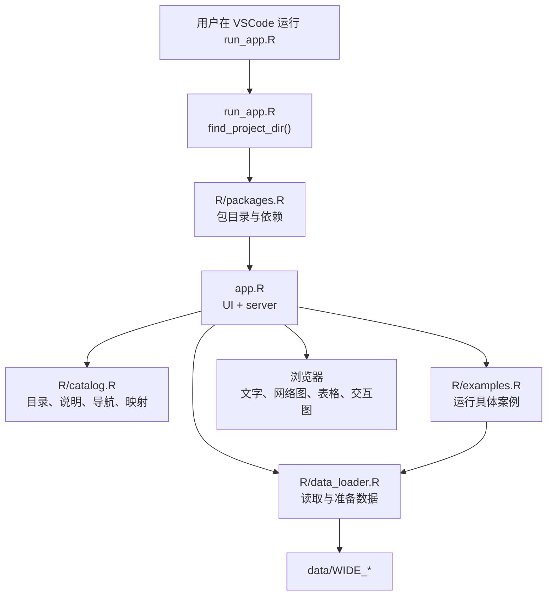
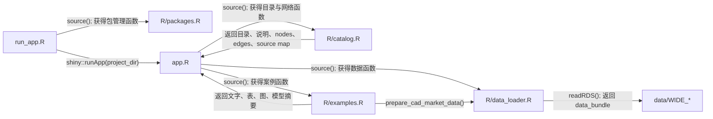
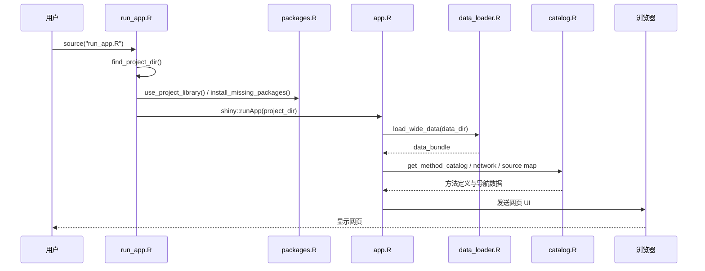
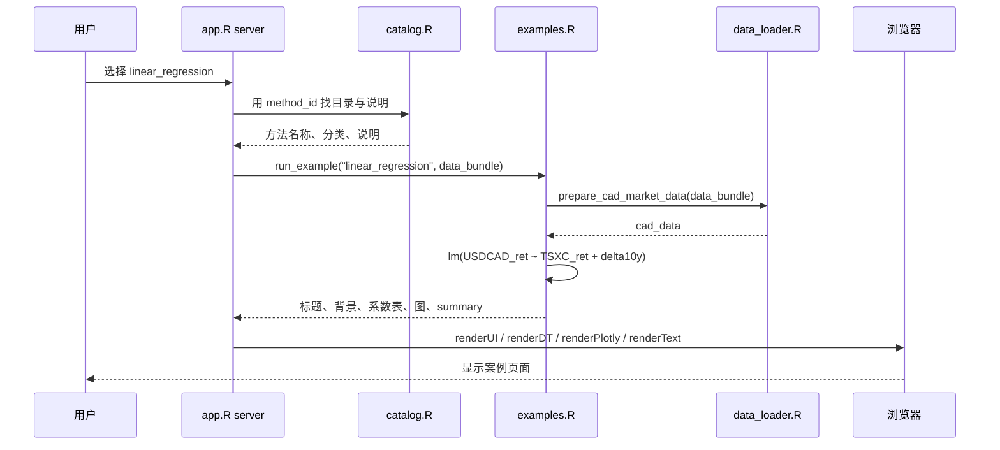
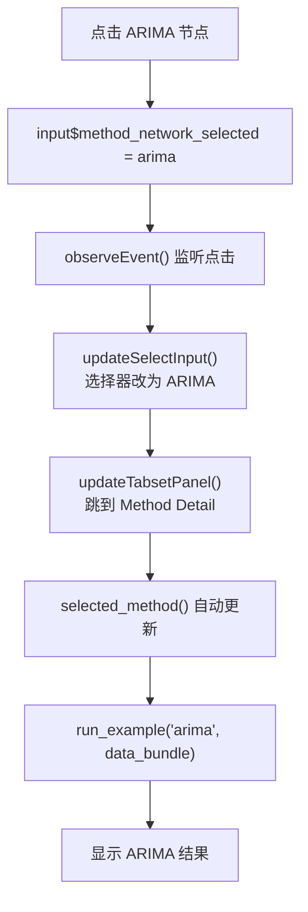
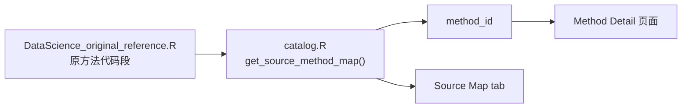
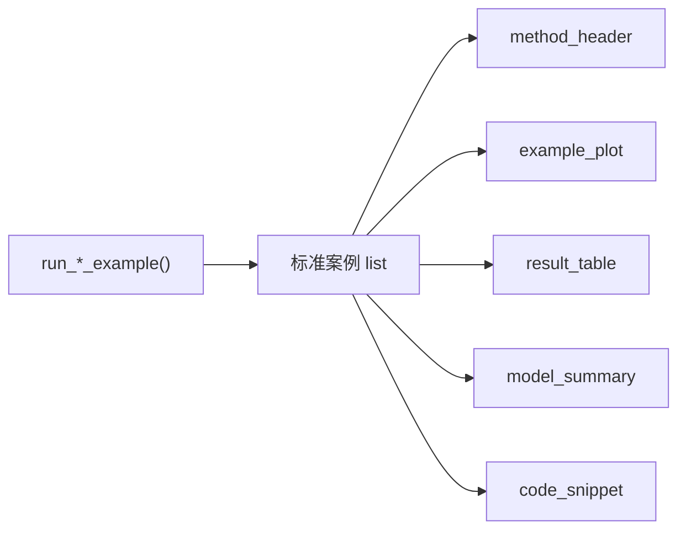
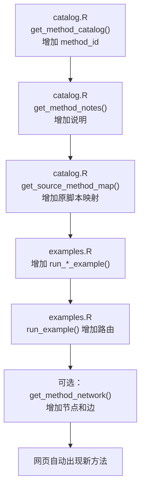

# DataScience Shiny 代码导引图

## 整体结构

项目可以理解为四层：启动、方法定义、数据与计算、网页展示。



## 文件引用与返回值



| 文件与函数 | 输入 | 返回 | 返回给谁 |
|---|---|---|---|
| `run_app.R / find_project_dir()` | 无 | 项目根目录路径 | `run_app.R` |
| `packages.R / project_library_path()` | 项目路径 | 当前 R 版本的包目录 | `run_app.R` |
| `data_loader.R / load_wide_data()` | `data/` 路径 | `data_bundle` 命名 list | `app.R`、案例函数 |
| `data_loader.R / prepare_cad_market_data()` | `data_bundle` | CAD 市场分析表 | 多个案例函数 |
| `catalog.R / get_method_catalog()` | 无 | 方法目录 data.frame | 左侧目录、方法详情 |
| `catalog.R / get_method_network()` | 无 | `nodes` 和 `edges` | Method Navigator |
| `catalog.R / get_source_method_map()` | 无 | 原脚本映射表 | Source Map |
| `examples.R / run_example()` | `example_id`、`data_bundle` | 标准案例 list | `app.R` |

## 网页启动顺序



- `run_app.R` 不做统计分析，只负责启动。
- `app.R` 启动时读取一次数据和目录定义。
- 用户选择具体方法时，才运行对应案例函数。

## 例子一：选择 Linear Regression



具体逻辑：

1. `selected_method()` 得到 `"linear_regression"`。
2. `selected_catalog_row()` 从目录找到方法信息。
3. `selected_example()` 调用 `run_example()`。
4. `run_example()` 路由到 `run_linear_regression_example()`。
5. 案例函数准备数据、运行 `lm()`，返回标准案例 list。
6. `app.R` 将 list 的各部分放入网页。

## 例子二：点击 Method Navigator 的 ARIMA



普通 R 脚本通常从上到下执行；Shiny 使用 `reactive()` 和 `observeEvent()`，
在用户点击或选择发生时自动触发相关计算。

## 例子三：Source Map 如何连接原脚本



`get_source_method_map()` 不执行原始代码。它记录原代码的位置、方法内容、
对应网页 `method_id` 和映射理由，使原脚本可以追溯。

## 标准案例返回结构

```r
list(
  title = "...",
  background = "...",
  code = "...",
  table = result_table,
  plot = plot_object,
  model_summary = "..."
)
```



所有案例返回相同结构，因此新增案例时通常不需要修改网页布局。

## 新增方法的代码路径



新增代码时遵守两个规则：

1. 数据读取与公共准备逻辑放在 `data_loader.R`。
2. 模型计算与绘图放在 `examples.R`，不要堆进 `app.R`。

