# DataScience Shiny 代码导引图

> 最新版更新：2026-06-16
> 这一版把新加入的 `R/selected_plots.R`、`tests/` 验证脚本、`UIimprove/plot_manifest_toKeep.csv` 已选图片流程，以及启动时 PNG 缓存机制都放进路线图。下面先看当前真实运行链路；旧版详细说明保留在后面作为补充。

---

## 0. 当前项目一眼看懂

这个项目现在有三条路线：

1. **正式网页路线**：你平时在 VSCode 跑 `run_app.R`，最后打开 Shiny dashboard。
2. **图片选择路线**：`UIimprove/plot_manifest_toKeep.csv` 决定哪些原始图进入 dashboard，`R/selected_plots.R` 负责重新运行背后的绘图算法。
3. **验证路线**：`tests/` 里的脚本检查代码能不能解析、图片数量对不对、缓存是不是按预期工作。

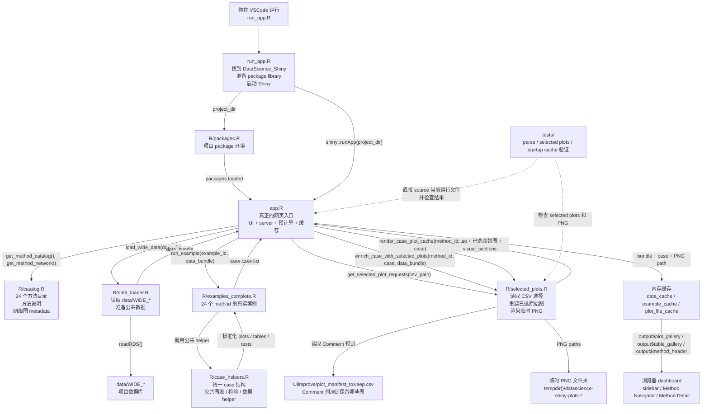
```mermaid
%%{init: {'flowchart': {'nodeSpacing': 60, 'rankSpacing': 95}, 'themeVariables': {'fontSize': '17px'}}}%%
flowchart TB
    User["你在 VSCode 运行<br/>run_app.R"]
    Run["run_app.R<br/>找到 DataScience_Shiny<br/>准备 package library<br/>启动 Shiny"]
    App["app.R<br/>真正的网页入口<br/>UI + server + 预计算 + 缓存"]

    Packages["R/packages.R<br/>项目 package 环境"]
    Catalog["R/catalog.R<br/>24 个方法目录<br/>方法说明<br/>网络图 metadata"]
    Loader["R/data_loader.R<br/>读取 data/WIDE_*<br/>准备公共数据"]
    Helpers["R/case_helpers.R<br/>统一 case 结构<br/>公共图表 / 检验 / 数据 helper"]
    Examples["R/examples_complete.R<br/>24 个 method 的真实案例"]
    Selected["R/selected_plots.R<br/>读取 CSV 选择<br/>重建已选原始图<br/>渲染临时 PNG"]

    Data["data/WIDE_*<br/>项目数据库"]
    KeepCSV["UIimprove/plot_manifest_toKeep.csv<br/>Comment 列决定保留哪些图"]
    Cache["内存缓存<br/>data_cache / example_cache / plot_file_cache"]
    TempPNG["临时 PNG 文件夹<br/>tempdir()/datascience-shiny-plots-*"]
    Browser["浏览器 dashboard<br/>sidebar / Method Navigator / Method Detail"]

    Tests["tests/<br/>parse / selected plots / startup cache 验证"]

    User --> Run
    Run -- "project_dir" --> Packages
    Packages -- "packages loaded" --> App
    Run -- "shiny::runApp(project_dir)" --> App

    App -- "get_method_catalog(), get_method_network()" --> Catalog
    App -- "load_wide_data(data_dir)" --> Loader
    Loader -- "readRDS()" --> Data
    Loader -- "data_bundle" --> App

    App -- "run_example(example_id, data_bundle)" --> Examples
    Examples -- "调用公共 helper" --> Helpers
    Helpers -- "标准化 plots / tables / tests" --> Examples
    Examples -- "base case list" --> App

    App -- "get_selected_plot_requests(csv_path)" --> Selected
    Selected -- "读取 Comment 规则" --> KeepCSV
    App -- "enrich_case_with_selected_plots(method_id, case, data_bundle)" --> Selected
    Selected -- "case + 已选原始图 + visual_sections" --> App
    App -- "render_case_plot_cache(method_id, case)" --> Selected
    Selected -- "PNG paths" --> TempPNG

    App -- "bundle + case + PNG path" --> Cache
    Cache -- "output$plot_gallery / output$table_gallery / output$method_header" --> Browser

    Tests -. "直接 source 当前运行文件并检查结果" .-> App
    Tests -. "检查 selected plots 和 PNG" .-> Selected
```

### 当前最重要的变量

| 变量 | 在哪里产生 | 里面是什么 | 后面影响什么 |
|---|---|---|---|
| `project_dir` | `run_app.R/find_project_dir()` | `C:/Users/PC/Desktop/R_git/DataScience_Shiny` | package 路径、data 路径、Shiny 启动目录 |
| `data_bundle` | `load_wide_data(data_dir)` | `rates/fx/vol/eco/cftc/mm/eq/comm/credit/allx` 等数据表 | 24 个案例、已选原始图重建 |
| `method_catalog` | `get_method_catalog()` | 24 个方法的分类、名称、`method_id`、`example_id` | 左侧目录、当前方法、预计算循环 |
| `selected_plot_requests` | `get_selected_plot_requests()` | CSV 中有 Comment 的图片行，以及 `keep=TRUE/FALSE` | 决定 Independence 到 ANCOVA 哪些图进 dashboard |
| `example_cache` | `app.R` 预计算时写入 | 每个 `method_id` 对应一个完整 case list | 普通点击方法时直接读，不重新跑模型 |
| `plot_file_cache` | `render_case_plot_cache()` 写入 | 每个 `method_id` 对应一组临时 PNG 路径 | `plot_gallery` 用 `` 直接显示 |
| `selected_method()` | 用户点击 sidebar / search / network 后改变 | 当前打开的方法，例如 `"correlation"` | 标题、说明、图、表、Source Map 全部切换 |
| `rerun_counter()` | 点击 `Re-run case` 后加 1 | 用来通知当前页面刷新图片 URL | 只重新计算当前 method，不动其他缓存 |

---

## 1. 怎么启动：从 VSCode 到网页

你平时只需要运行：

```r
source("C:/Users/PC/Desktop/R_git/DataScience_Shiny/run_app.R")
```

或者在 VSCode 里打开 `run_app.R` 后 source 当前文件。

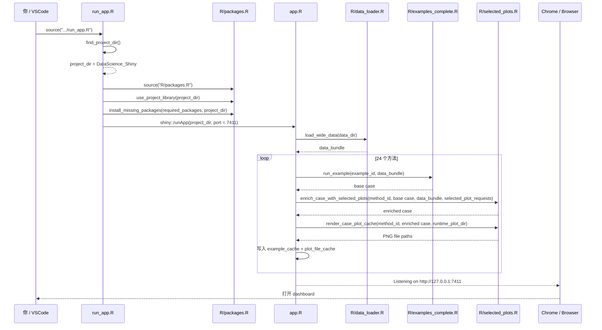
```mermaid
%%{init: {'sequence': {'actorMargin': 65, 'messageMargin': 50}, 'themeVariables': {'fontSize': '16px'}}}%%
sequenceDiagram
    participant U as 你 / VSCode
    participant R as run_app.R
    participant P as R/packages.R
    participant A as app.R
    participant L as R/data_loader.R
    participant E as R/examples_complete.R
    participant S as R/selected_plots.R
    participant B as Chrome / Browser

    U->>R: source(".../run_app.R")
    R->>R: find_project_dir()
    R-->>R: project_dir = DataScience_Shiny
    R->>P: source("R/packages.R")
    R->>P: use_project_library(project_dir)
    R->>P: install_missing_packages(required_packages, project_dir)
    R->>A: shiny::runApp(project_dir, port = 7411)

    A->>L: load_wide_data(data_dir)
    L-->>A: data_bundle

    loop 24 个方法
        A->>E: run_example(example_id, data_bundle)
        E-->>A: base case
        A->>S: enrich_case_with_selected_plots(method_id, base case, data_bundle, selected_plot_requests)
        S-->>A: enriched case
        A->>S: render_case_plot_cache(method_id, enriched case, runtime_plot_dir)
        S-->>A: PNG file paths
        A->>A: 写入 example_cache + plot_file_cache
    end

    A-->>B: Listening on http://127.0.0.1:7411
    B-->>U: 打开 dashboard
```

### 初始运行时变量怎么变

```text
启动前：
data_cache      = 空
example_cache   = 空
plot_file_cache = 空

app.R 预计算后：
data_cache$bundle                  = 10 个 WIDE_* 数据表
example_cache$linear_regression     = Linear Regression 完整 case
example_cache$correlation           = Correlation 完整 case
...
plot_file_cache$correlation         = 4 个临时 PNG 路径
plot_file_cache$anova               = 9 个临时 PNG 路径

网页打开时：
selected_method() = "linear_regression"
runtime$percent   = 100
```

---

## 2. 正式运行文件关系图

这一张只画当前 dashboard 真正会执行的文件。

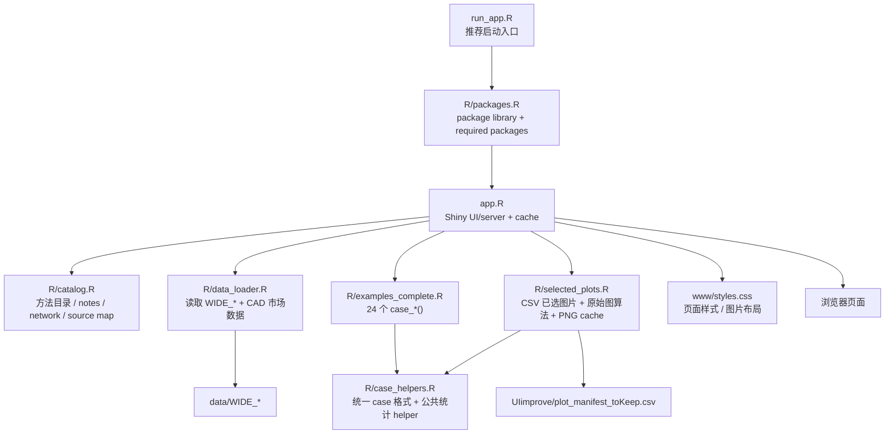
```mermaid
%%{init: {'flowchart': {'nodeSpacing': 55, 'rankSpacing': 85}, 'themeVariables': {'fontSize': '17px'}}}%%
flowchart TB
    Run["run_app.R<br/>推荐启动入口"]
    Packages["R/packages.R<br/>package library + required packages"]
    App["app.R<br/>Shiny UI/server + cache"]
    Catalog["R/catalog.R<br/>方法目录 / notes / network / source map"]
    Loader["R/data_loader.R<br/>读取 WIDE_* + CAD 市场数据"]
    Helpers["R/case_helpers.R<br/>统一 case 格式 + 公共统计 helper"]
    Examples["R/examples_complete.R<br/>24 个 case_*()"]
    Selected["R/selected_plots.R<br/>CSV 已选图片 + 原始图算法 + PNG cache"]
    CSS["www/styles.css<br/>页面样式 / 图片布局"]
    Data["data/WIDE_*"]
    CSV["UIimprove/plot_manifest_toKeep.csv"]
    Browser["浏览器页面"]

    Run --> Packages --> App
    App --> Catalog
    App --> Loader --> Data
    App --> Examples --> Helpers
    App --> Selected --> CSV
    Selected --> Helpers
    App --> CSS
    App --> Browser
```

---

## 3. `app.R` 当前做了什么

`app.R` 现在不再是“点一下才临时画图”的模式，而是：

1. 启动时读数据；
2. 启动时运行全部 24 个 case；
3. 启动时把每个 case 的 plot 渲染成临时 PNG；
4. 页面点击时只换图片路径和文字；
5. 只有点击 `Re-run case` 才重新计算当前 method。

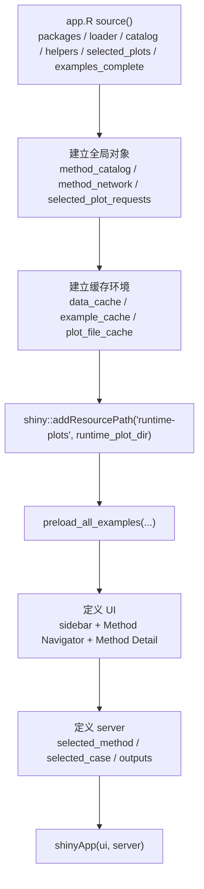
```mermaid
%%{init: {'flowchart': {'nodeSpacing': 55, 'rankSpacing': 85}, 'themeVariables': {'fontSize': '16px'}}}%%
flowchart TB
    Source["app.R source()<br/>packages / loader / catalog / helpers / selected_plots / examples_complete"]
    Objects["建立全局对象<br/>method_catalog / method_network / selected_plot_requests"]
    Envs["建立缓存环境<br/>data_cache / example_cache / plot_file_cache"]
    Resource["shiny::addResourcePath('runtime-plots', runtime_plot_dir)"]
    Preload["preload_all_examples(...)"]
    UI["定义 UI<br/>sidebar + Method Navigator + Method Detail"]
    Server["定义 server<br/>selected_method / selected_case / outputs"]
    AppObj["shinyApp(ui, server)"]

    Source --> Objects --> Envs --> Resource --> Preload --> UI --> Server --> AppObj
```

### `preload_all_examples()` 的输入输出

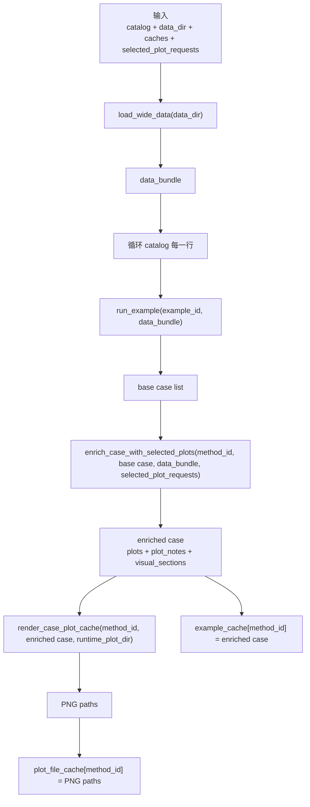
```mermaid
%%{init: {'flowchart': {'nodeSpacing': 55, 'rankSpacing': 85}, 'themeVariables': {'fontSize': '16px'}}}%%
flowchart TB
    Inputs["输入<br/>catalog + data_dir + caches + selected_plot_requests"]
    Load["load_wide_data(data_dir)"]
    Bundle["data_bundle"]
    Loop["循环 catalog 每一行"]
    Example["run_example(example_id, data_bundle)"]
    Base["base case list"]
    Enrich["enrich_case_with_selected_plots(method_id, base case, data_bundle, selected_plot_requests)"]
    Enriched["enriched case<br/>plots + plot_notes + visual_sections"]
    Render["render_case_plot_cache(method_id, enriched case, runtime_plot_dir)"]
    Paths["PNG paths"]
    Assign1["example_cache[method_id] = enriched case"]
    Assign2["plot_file_cache[method_id] = PNG paths"]

    Inputs --> Load --> Bundle --> Loop
    Loop --> Example --> Base --> Enrich --> Enriched
    Enriched --> Render --> Paths
    Enriched --> Assign1
    Paths --> Assign2
```

---

## 4. `R/selected_plots.R`：这次新增图片如何进入 dashboard

这个文件是本轮新增的关键文件。它不改变 CSV，也不复制旧 PNG，而是根据 CSV 的 Comment 规则，重新运行背后的绘图算法。

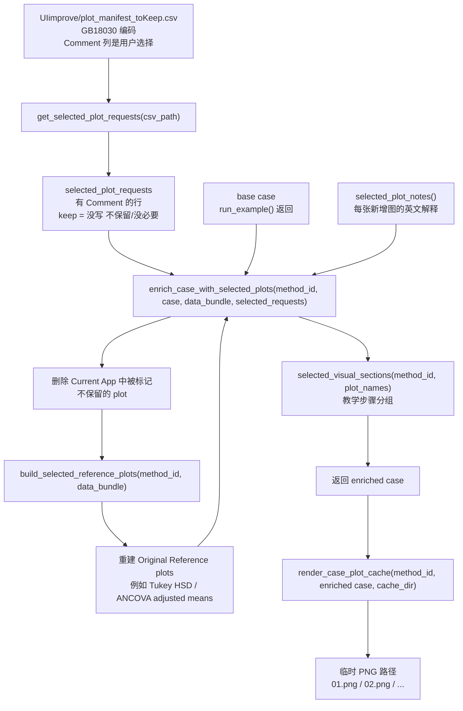
```mermaid
%%{init: {'flowchart': {'nodeSpacing': 55, 'rankSpacing': 85}, 'themeVariables': {'fontSize': '16px'}}}%%
flowchart TB
    CSV["UIimprove/plot_manifest_toKeep.csv<br/>GB18030 编码<br/>Comment 列是用户选择"]
    Requests["get_selected_plot_requests(csv_path)"]
    RequestDF["selected_plot_requests<br/>有 Comment 的行<br/>keep = 没写 不保留/没必要"]

    Case["base case<br/>run_example() 返回"]
    Enrich["enrich_case_with_selected_plots(method_id, case, data_bundle, selected_requests)"]
    Drop["删除 Current App 中被标记不保留的 plot"]
    Build["build_selected_reference_plots(method_id, data_bundle)"]
    Rebuilt["重建 Original Reference plots<br/>例如 Tukey HSD / ANCOVA adjusted means"]
    Notes["selected_plot_notes()<br/>每张新增图的英文解释"]
    Sections["selected_visual_sections(method_id, plot_names)<br/>教学步骤分组"]
    Enriched["返回 enriched case"]

    Render["render_case_plot_cache(method_id, enriched case, cache_dir)"]
    PNG["临时 PNG 路径<br/>01.png / 02.png / ..."]

    CSV --> Requests --> RequestDF --> Enrich
    Case --> Enrich
    Enrich --> Drop --> Build --> Rebuilt
    Notes --> Enrich
    Rebuilt --> Enrich
    Enrich --> Sections --> Enriched
    Enriched --> Render --> PNG
```

### 例子：ANOVA 图片怎么被组织

```text
CSV 中 method_id = "anova" 且 Comment 保留的 Original Reference：
p_10y
p3
source_plot_018
change10y_NFP_cat_plot_violin
change10y_NFP_cat_plot_ridge
tuk_plot
source_plot_023
NFP_RISK_Effect

再加上 Current App 中保留的：
Group distributions

最后 ANOVA 页面显示 9 张图。
```

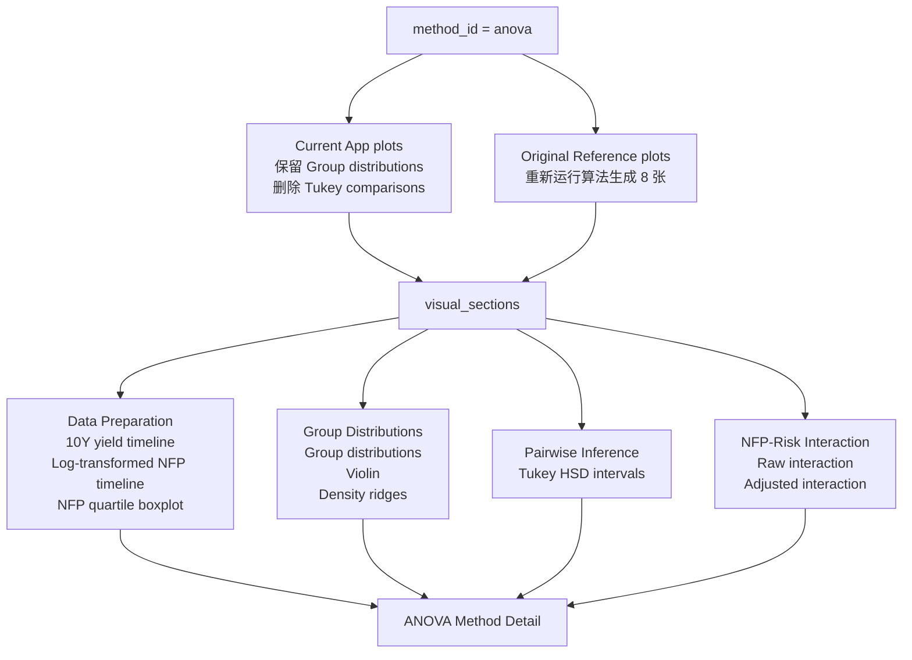
```mermaid
%%{init: {'flowchart': {'nodeSpacing': 50, 'rankSpacing': 80}, 'themeVariables': {'fontSize': '16px'}}}%%
flowchart TB
    ANOVA["method_id = anova"]
    Current["Current App plots<br/>保留 Group distributions<br/>删除 Tukey comparisons"]
    Original["Original Reference plots<br/>重新运行算法生成 8 张"]
    Sections["visual_sections"]
    Prep["Data Preparation<br/>10Y yield timeline<br/>Log-transformed NFP timeline<br/>NFP quartile boxplot"]
    Dist["Group Distributions<br/>Group distributions<br/>Violin<br/>Density ridges"]
    Tukey["Pairwise Inference<br/>Tukey HSD intervals"]
    Interact["NFP-Risk Interaction<br/>Raw interaction<br/>Adjusted interaction"]
    Page["ANOVA Method Detail"]

    ANOVA --> Current
    ANOVA --> Original
    Current --> Sections
    Original --> Sections
    Sections --> Prep --> Page
    Sections --> Dist --> Page
    Sections --> Tukey --> Page
    Sections --> Interact --> Page
```

---

## 5. 用户点击后发生什么

### 案例 A：点击左侧 `Correlation`

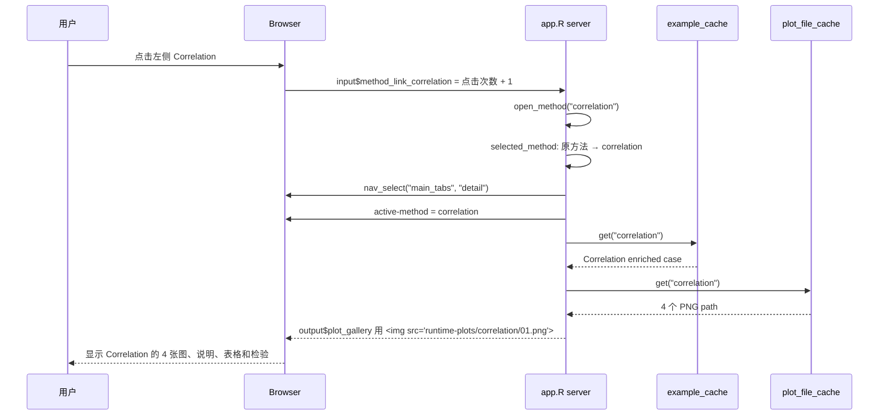
```mermaid
%%{init: {'sequence': {'actorMargin': 60, 'messageMargin': 45}, 'themeVariables': {'fontSize': '16px'}}}%%
sequenceDiagram
    participant U as 用户
    participant B as Browser
    participant A as app.R server
    participant EC as example_cache
    participant PC as plot_file_cache

    U->>B: 点击左侧 Correlation
    B->>A: input$method_link_correlation = 点击次数 + 1
    A->>A: open_method("correlation")
    A->>A: selected_method: 原方法 → correlation
    A->>B: nav_select("main_tabs", "detail")
    A->>B: active-method = correlation
    A->>EC: get("correlation")
    EC-->>A: Correlation enriched case
    A->>PC: get("correlation")
    PC-->>A: 4 个 PNG path
    A-->>B: output$plot_gallery 用 <img src="runtime-plots/correlation/01.png">
    B-->>U: 显示 Correlation 的 4 张图、说明、表格和检验
```

这里没有重新运行 `run_example()`，也没有重新读取数据。

### 案例 B：点击 Method Navigator 里的方法节点

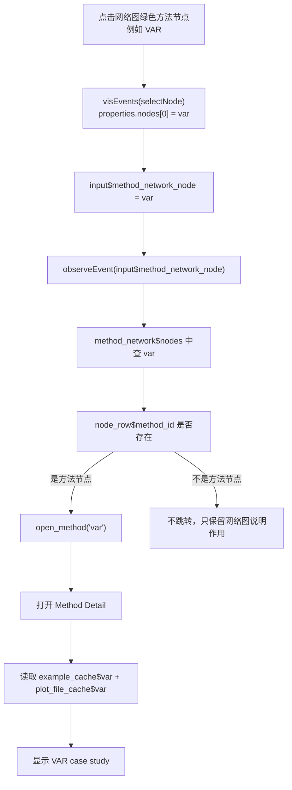
```mermaid
%%{init: {'flowchart': {'nodeSpacing': 55, 'rankSpacing': 85}, 'themeVariables': {'fontSize': '16px'}}}%%
flowchart TB
    Click["点击网络图绿色方法节点<br/>例如 VAR"]
    JS["visEvents(selectNode)<br/>properties.nodes[0] = var"]
    Input["input$method_network_node = var"]
    Observe["observeEvent(input$method_network_node)"]
    NodeRow["method_network$nodes 中查 var"]
    Check["node_row$method_id 是否存在"]
    Open["open_method('var')"]
    Detail["打开 Method Detail"]
    Cache["读取 example_cache$var + plot_file_cache$var"]
    Page["显示 VAR case study"]

    Click --> JS --> Input --> Observe --> NodeRow --> Check
    Check -- "是方法节点" --> Open --> Detail --> Cache --> Page
    Check -- "不是方法节点" --> Stop["不跳转，只保留网络图说明作用"]
```

### 案例 C：搜索 `USDCAD`

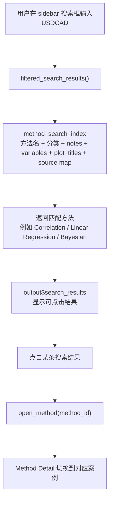
```mermaid
%%{init: {'flowchart': {'nodeSpacing': 55, 'rankSpacing': 85}, 'themeVariables': {'fontSize': '16px'}}}%%
flowchart TB
    Type["用户在 sidebar 搜索框输入<br/>USDCAD"]
    Reactive["filtered_search_results()"]
    Index["method_search_index<br/>方法名 + 分类 + notes + variables + plot_titles + source map"]
    Match["返回匹配方法<br/>例如 Correlation / Linear Regression / Bayesian"]
    ResultUI["output$search_results<br/>显示可点击结果"]
    Click["点击某条搜索结果"]
    Open["open_method(method_id)"]
    Page["Method Detail 切换到对应案例"]

    Type --> Reactive --> Index --> Match --> ResultUI --> Click --> Open --> Page
```

### 案例 D：点击 `Re-run case`

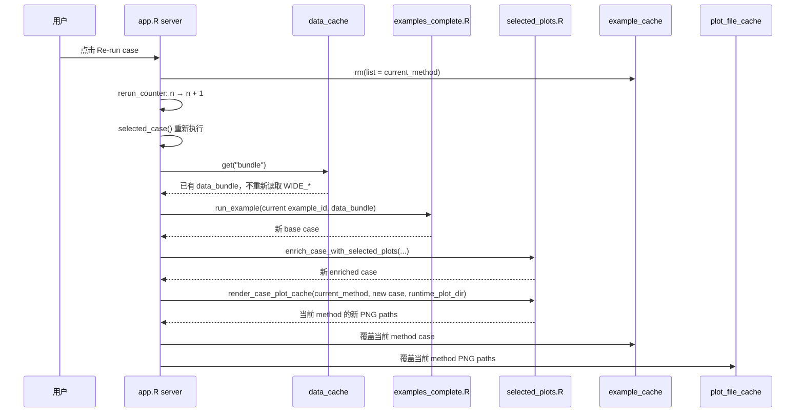
```mermaid
%%{init: {'sequence': {'actorMargin': 60, 'messageMargin': 45}, 'themeVariables': {'fontSize': '16px'}}}%%
sequenceDiagram
    participant U as 用户
    participant A as app.R server
    participant D as data_cache
    participant E as examples_complete.R
    participant S as selected_plots.R
    participant EC as example_cache
    participant PC as plot_file_cache

    U->>A: 点击 Re-run case
    A->>EC: rm(list = current_method)
    A->>A: rerun_counter: n → n + 1
    A->>A: selected_case() 重新执行
    A->>D: get("bundle")
    D-->>A: 已有 data_bundle，不重新读取 WIDE_*
    A->>E: run_example(current example_id, data_bundle)
    E-->>A: 新 base case
    A->>S: enrich_case_with_selected_plots(...)
    S-->>A: 新 enriched case
    A->>S: render_case_plot_cache(current_method, new case, runtime_plot_dir)
    S-->>A: 当前 method 的新 PNG paths
    A->>EC: 覆盖当前 method case
    A->>PC: 覆盖当前 method PNG paths
```

只有当前方法会重新计算；其他 23 个方法的 `example_cache` 和 `plot_file_cache` 保持不变。

---

## 6. `tests/`：这些脚本是怎么验证项目的

`tests/` 不是网页运行必须文件，但它们是用来确认“现在这个结构确实能跑”的工具。

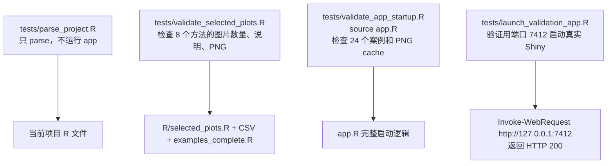
```mermaid
%%{init: {'flowchart': {'nodeSpacing': 55, 'rankSpacing': 85}, 'themeVariables': {'fontSize': '16px'}}}%%
flowchart TB
    Parse["tests/parse_project.R<br/>只 parse，不运行 app"]
    SelectedTest["tests/validate_selected_plots.R<br/>检查 8 个方法的图片数量、说明、PNG"]
    StartupTest["tests/validate_app_startup.R<br/>source app.R<br/>检查 24 个案例和 PNG cache"]
    Launch["tests/launch_validation_app.R<br/>验证用端口 7412 启动真实 Shiny"]

    Project["当前项目 R 文件"]
    Selected["R/selected_plots.R + CSV + examples_complete.R"]
    App["app.R 完整启动逻辑"]
    HTTP["Invoke-WebRequest http://127.0.0.1:7412<br/>返回 HTTP 200"]

    Parse --> Project
    SelectedTest --> Selected
    StartupTest --> App
    Launch --> HTTP
```

### 验证脚本各自回答什么问题

| 文件 | 回答的问题 | 会不会启动网页 |
|---|---|---|
| `tests/parse_project.R` | 所有 `.R` 文件语法有没有坏 | 不会 |
| `tests/validate_selected_plots.R` | Independence 到 ANCOVA 图片数量是否符合 CSV 选择，PNG 是否非空 | 不会 |
| `tests/validate_app_startup.R` | `app.R` 启动前是否把 24 个 case 和 PNG 都准备好；普通切换和 Re-run 缓存是否正确 | 不会打开浏览器 |
| `tests/launch_validation_app.R` | 用 7412 端口跑真实 Shiny，方便 HTTP/browser 检查 | 会启动 Shiny 服务 |

---

## 7. `UIimprove/`：图册和 CSV 怎么影响当前 dashboard

`UIimprove/` 最开始是为了把原始 `DataScience_original_reference.R` 里的图整理成 HTML 图册。现在 dashboard 只读取其中一个文件：`plot_manifest_toKeep.csv`。

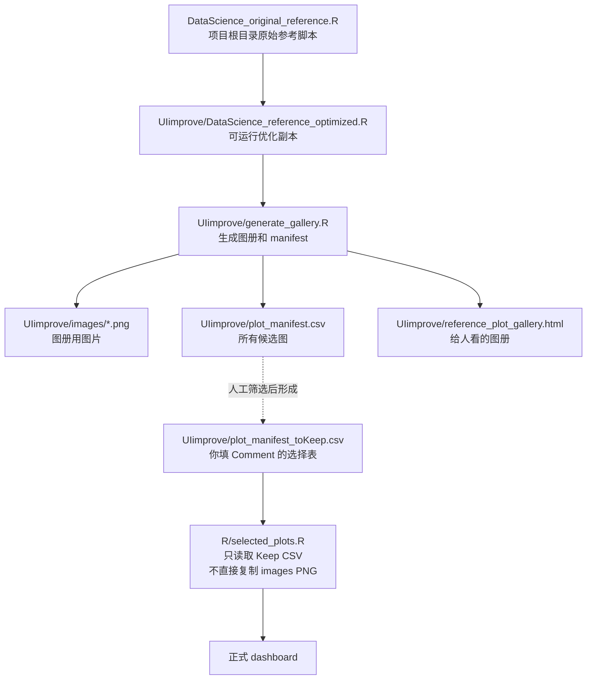
```mermaid
%%{init: {'flowchart': {'nodeSpacing': 55, 'rankSpacing': 85}, 'themeVariables': {'fontSize': '16px'}}}%%
flowchart TB
    Original["DataScience_original_reference.R<br/>项目根目录原始参考脚本"]
    Optimized["UIimprove/DataScience_reference_optimized.R<br/>可运行优化副本"]
    GalleryScript["UIimprove/generate_gallery.R<br/>生成图册和 manifest"]
    Images["UIimprove/images/*.png<br/>图册用图片"]
    Manifest["UIimprove/plot_manifest.csv<br/>所有候选图"]
    Gallery["UIimprove/reference_plot_gallery.html<br/>给人看的图册"]
    Keep["UIimprove/plot_manifest_toKeep.csv<br/>你填 Comment 的选择表"]
    Selected["R/selected_plots.R<br/>只读取 Keep CSV<br/>不直接复制 images PNG"]
    Dashboard["正式 dashboard"]

    Original --> Optimized --> GalleryScript
    GalleryScript --> Images
    GalleryScript --> Manifest
    GalleryScript --> Gallery
    Manifest -. "人工筛选后形成" .-> Keep
    Keep --> Selected --> Dashboard
```

### 重要区别

| 文件 | 当前 dashboard 会不会直接执行 | 作用 |
|---|---:|---|
| `UIimprove/reference_plot_gallery.html` | 否 | 给你看图、决定保留哪些 |
| `UIimprove/images/*.png` | 否 | 图册里的静态图片 |
| `UIimprove/plot_manifest.csv` | 否 | 候选图清单 |
| `UIimprove/plot_manifest_toKeep.csv` | 是，读取 | Comment 列决定本轮图片选择 |
| `R/selected_plots.R` | 是，执行 | 根据 CSV 决定图，并重新运行算法生成 dashboard 图片 |

---

## 8. 每个主要 R 文件的小路线图

### `run_app.R`

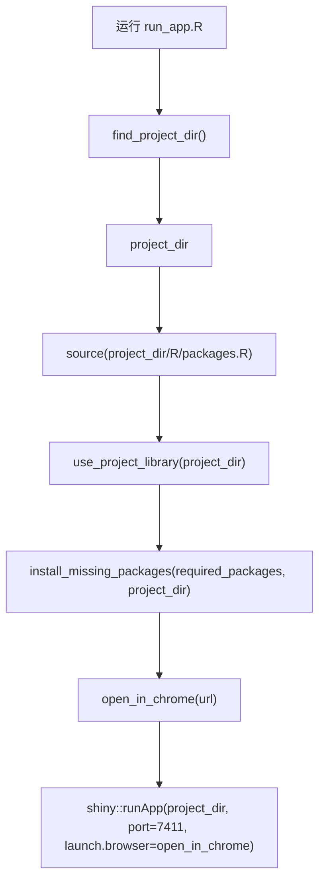
```mermaid
%%{init: {'flowchart': {'nodeSpacing': 55, 'rankSpacing': 85}, 'themeVariables': {'fontSize': '16px'}}}%%
flowchart TB
    Start["运行 run_app.R"]
    Find["find_project_dir()"]
    Project["project_dir"]
    SourcePkg["source(project_dir/R/packages.R)"]
    Lib["use_project_library(project_dir)"]
    Install["install_missing_packages(required_packages, project_dir)"]
    Chrome["open_in_chrome(url)"]
    RunApp["shiny::runApp(project_dir, port=7411, launch.browser=open_in_chrome)"]

    Start --> Find --> Project --> SourcePkg --> Lib --> Install --> Chrome --> RunApp
```

### `R/packages.R`

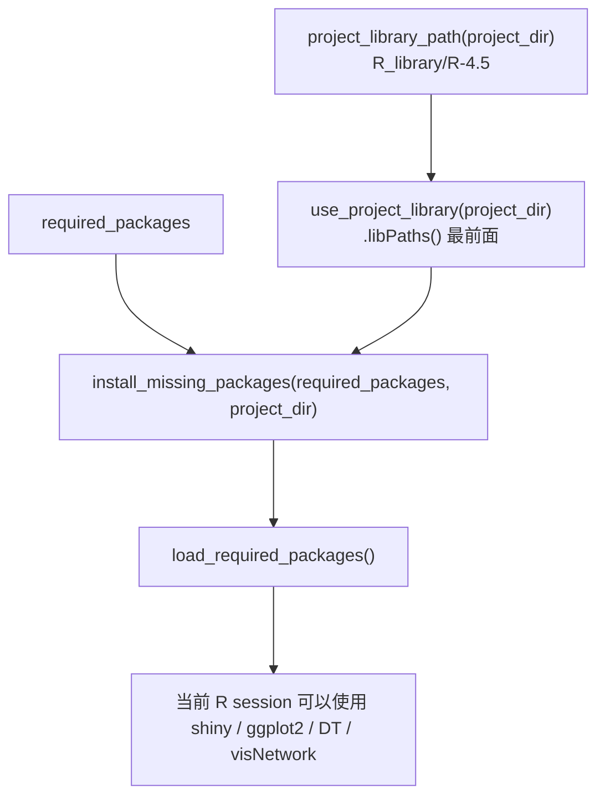
```mermaid
%%{init: {'flowchart': {'nodeSpacing': 50, 'rankSpacing': 80}, 'themeVariables': {'fontSize': '16px'}}}%%
flowchart TB
    Required["required_packages"]
    Path["project_library_path(project_dir)<br/>R_library/R-4.5"]
    Use["use_project_library(project_dir)<br/>.libPaths() 最前面"]
    Install["install_missing_packages(required_packages, project_dir)"]
    Load["load_required_packages()"]
    Session["当前 R session 可以使用 shiny / ggplot2 / DT / visNetwork"]

    Required --> Install
    Path --> Use --> Install --> Load --> Session
```

### `R/data_loader.R`

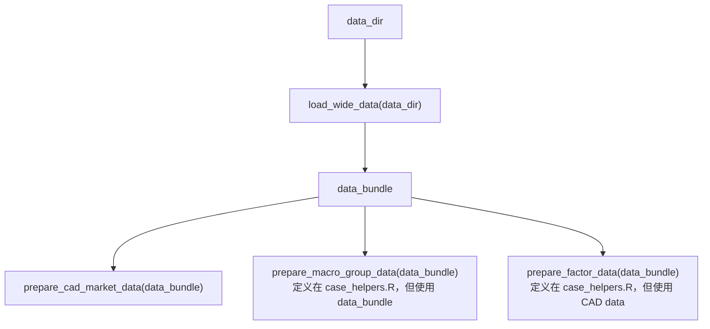
```mermaid
%%{init: {'flowchart': {'nodeSpacing': 50, 'rankSpacing': 80}, 'themeVariables': {'fontSize': '16px'}}}%%
flowchart TB
    DataDir["data_dir"]
    Load["load_wide_data(data_dir)"]
    Bundle["data_bundle"]
    CAD["prepare_cad_market_data(data_bundle)"]
    Macro["prepare_macro_group_data(data_bundle)<br/>定义在 case_helpers.R，但使用 data_bundle"]
    Factor["prepare_factor_data(data_bundle)<br/>定义在 case_helpers.R，但使用 CAD data"]

    DataDir --> Load --> Bundle
    Bundle --> CAD
    Bundle --> Macro
    Bundle --> Factor
```

### `R/catalog.R`

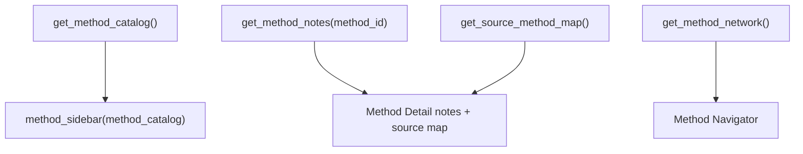
```mermaid
%%{init: {'flowchart': {'nodeSpacing': 50, 'rankSpacing': 80}, 'themeVariables': {'fontSize': '16px'}}}%%
flowchart TB
    Catalog["get_method_catalog()"]
    Notes["get_method_notes(method_id)"]
    SourceMap["get_source_method_map()"]
    Network["get_method_network()"]
    Sidebar["method_sidebar(method_catalog)"]
    Detail["Method Detail notes + source map"]
    Navigator["Method Navigator"]

    Catalog --> Sidebar
    Notes --> Detail
    SourceMap --> Detail
    Network --> Navigator
```

### `R/case_helpers.R`

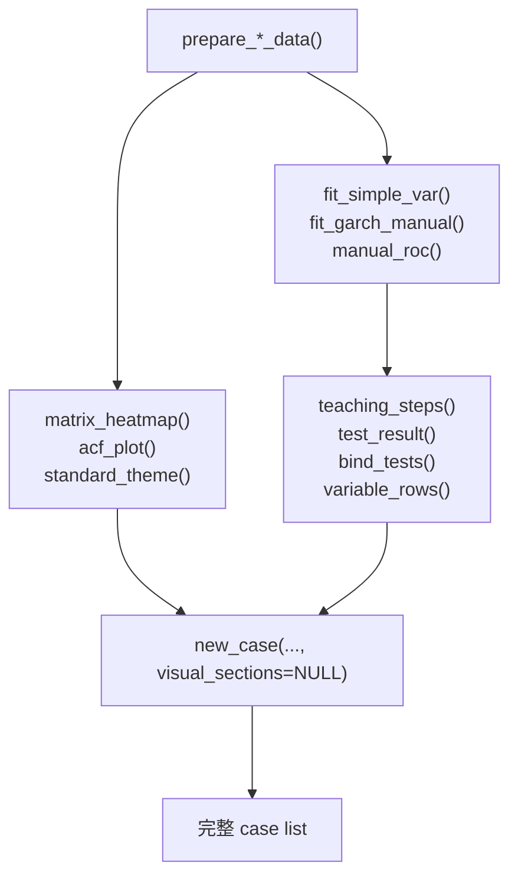
```mermaid
%%{init: {'flowchart': {'nodeSpacing': 50, 'rankSpacing': 80}, 'themeVariables': {'fontSize': '16px'}}}%%
flowchart TB
    DataHelpers["prepare_*_data()"]
    ModelHelpers["fit_simple_var()<br/>fit_garch_manual()<br/>manual_roc()"]
    PlotHelpers["matrix_heatmap()<br/>acf_plot()<br/>standard_theme()"]
    ResultHelpers["teaching_steps()<br/>test_result()<br/>bind_tests()<br/>variable_rows()"]
    NewCase["new_case(..., visual_sections=NULL)"]
    Case["完整 case list"]

    DataHelpers --> ModelHelpers
    DataHelpers --> PlotHelpers
    ModelHelpers --> ResultHelpers
    PlotHelpers --> NewCase
    ResultHelpers --> NewCase --> Case
```

### `R/examples_complete.R`

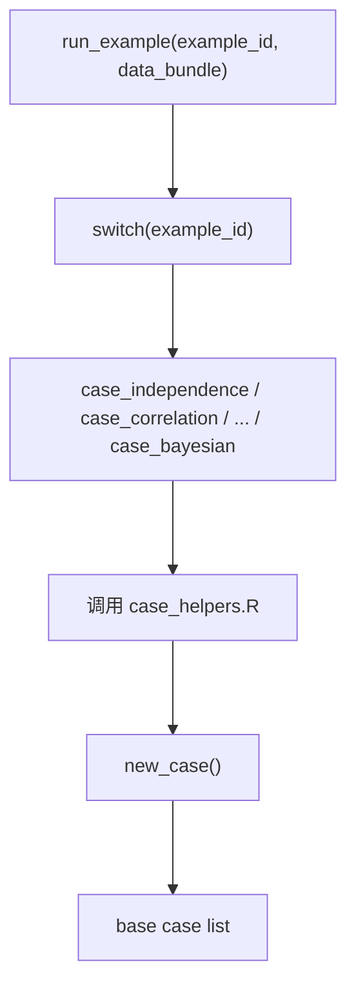
```mermaid
%%{init: {'flowchart': {'nodeSpacing': 45, 'rankSpacing': 75}, 'themeVariables': {'fontSize': '15px'}}}%%
flowchart TB
    RunExample["run_example(example_id, data_bundle)"]
    Switch["switch(example_id)"]
    Cases["case_independence / case_correlation / ... / case_bayesian"]
    Helpers["调用 case_helpers.R"]
    NewCase["new_case()"]
    BaseCase["base case list"]

    RunExample --> Switch --> Cases --> Helpers --> NewCase --> BaseCase
```

### `R/selected_plots.R`

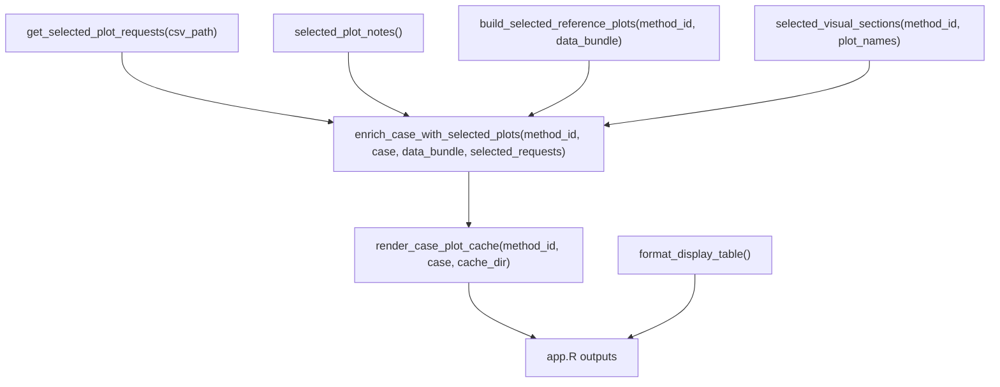
```mermaid
%%{init: {'flowchart': {'nodeSpacing': 50, 'rankSpacing': 80}, 'themeVariables': {'fontSize': '16px'}}}%%
flowchart TB
    Read["get_selected_plot_requests(csv_path)"]
    Notes["selected_plot_notes()"]
    Build["build_selected_reference_plots(method_id, data_bundle)"]
    Sections["selected_visual_sections(method_id, plot_names)"]
    Enrich["enrich_case_with_selected_plots(method_id, case, data_bundle, selected_requests)"]
    Format["format_display_table()"]
    Render["render_case_plot_cache(method_id, case, cache_dir)"]
    App["app.R outputs"]

    Read --> Enrich
    Notes --> Enrich
    Build --> Enrich
    Sections --> Enrich
    Enrich --> Render --> App
    Format --> App
```

### `R/examples.R`

```mermaid
%%{init: {'flowchart': {'nodeSpacing': 50, 'rankSpacing': 80}, 'themeVariables': {'fontSize': '16px'}}}%%
flowchart TB
    Old["R/examples.R<br/>旧版案例实现"]
    Current["当前 app.R"]
    New["R/examples_complete.R"]

    Old -. "当前不被 app.R source" .-> Current
    New --> Current
```

---

## 9. 参考文件、历史文件、运行文件怎么区分

| 路径 | 类型 | 当前网页启动时会不会执行 | 说明 |
|---|---|---:|---|
| `run_app.R` | 正式入口 | 是 | VSCode/RStudio 推荐 source 这个 |
| `app.R` | 正式 Shiny 主程序 | 是 | UI、server、预计算、缓存都在这里连起来 |
| `R/packages.R` | 正式依赖管理 | 是 | 设置项目 library，加载 package |
| `R/data_loader.R` | 正式数据读取 | 是 | 读取 `data/WIDE_*` |
| `R/catalog.R` | 正式目录 metadata | 是 | 方法目录、说明、网络图、source map |
| `R/case_helpers.R` | 正式公共 helper | 是 | 被案例和 selected plots 调用 |
| `R/examples_complete.R` | 正式案例库 | 是 | 24 个方法的 case |
| `R/selected_plots.R` | 正式图片选择逻辑 | 是 | 本轮新增，接入 CSV 选择和 PNG 缓存 |
| `www/styles.css` | 正式样式 | 是 | 控制 dashboard 布局和图片显示 |
| `UIimprove/plot_manifest_toKeep.csv` | 正式配置输入 | 是，读取 | 只读取，不修改 |
| `tests/*.R` | 验证工具 | 否 | 手动运行检查项目 |
| `DataScience_optimized.R` | 脚本版学习入口 | 否 | 不启动网页，用来理解和复用分析逻辑 |
| `DataScience_original_reference.R` | 原始参考 | 否 | 保留原始算法和旧图 |
| `R/examples.R` | 历史版本 | 否 | 第一版案例参考 |
| `samplecomment.R` | 注释风格样例 | 否 | 给注释 skill 当风格参考 |
| `UIimprove/reference_plot_gallery.html` | 图册 | 否 | 给人看图，不被 dashboard 直接读取 |

---

## 10. 新增或调整图片时应该改哪里

```mermaid
%%{init: {'flowchart': {'nodeSpacing': 55, 'rankSpacing': 85}, 'themeVariables': {'fontSize': '16px'}}}%%
flowchart TB
    UserCSV["你修改 plot_manifest_toKeep.csv 的 Comment"]
    Read["get_selected_plot_requests() 读取新选择"]
    Existing["如果只是 Current App 图保留/不保留"]
    Drop["enrich_case_with_selected_plots() 删除或保留现有 plot"]
    NewOriginal["如果要新增 Original Reference 图"]
    Algorithm["需要在 build_selected_reference_plots() 增加对应绘图算法"]
    Note["selected_plot_notes() 增加英文图片说明"]
    Section["selected_visual_sections() 放到教学步骤里"]
    Startup["重新运行 run_app.R"]
    Dashboard["dashboard 显示新图片结构"]

    UserCSV --> Read
    Read --> Existing --> Drop --> Startup
    Read --> NewOriginal --> Algorithm --> Note --> Section --> Startup --> Dashboard
```

### 大白话规则

- 只改 CSV Comment：适合当前已经支持的图片。
- 要加一张新的原始图：除了 CSV，还要在 `R/selected_plots.R` 写重建算法、说明和分组。
- 不建议直接把 `UIimprove/images/*.png` 复制进 dashboard，因为那样图片不会跟数据和模型同步。

---

## 11. 新增一个统计方法时应该改哪里

```mermaid
%%{init: {'flowchart': {'nodeSpacing': 55, 'rankSpacing': 85}, 'themeVariables': {'fontSize': '16px'}}}%%
flowchart TB
    Catalog["R/catalog.R<br/>get_method_catalog() 增加 method_id/example_id"]
    Notes["R/catalog.R<br/>get_method_notes() 增加方法说明"]
    Network["R/catalog.R<br/>get_method_network() 可选增加节点和边"]
    Data["R/data_loader.R 或 R/case_helpers.R<br/>准备新案例需要的数据"]
    Case["R/examples_complete.R<br/>新增 case_new_method(data_bundle)"]
    Route["run_example() switch() 增加 example_id 路由"]
    Output["new_case() 返回 plots/tables/tests/code/conclusion"]
    OptionalPlots["R/selected_plots.R<br/>如果有原始参考图选择，再接入"]
    App["app.R 不需要专门改<br/>会按 catalog 自动预计算和显示"]

    Catalog --> Notes --> Network --> Data --> Case --> Route --> Output --> App
    OptionalPlots --> App
```

---

## 12. 当前验证结果对应的运行逻辑

这几个验证结果说明当前代码链路是通的：

```text
tests/parse_project.R
→ 所有 R 文件 parse OK

tests/validate_selected_plots.R
→ Independence Test: 3 PNG
→ Correlation: 4 PNG
→ Partial Correlation: 4 PNG
→ Linear Regression: 3 PNG
→ Polynomial Regression: 2 PNG
→ Subset Regression: 2 PNG
→ ANOVA: 9 PNG
→ ANCOVA: 6 PNG

tests/validate_app_startup.R
→ 24 个 case 都在 Shiny 打开前计算完成
→ 每个 case 都有 PNG cache
→ 普通切换 method 不改缓存
→ Re-run case 只替换当前 method 缓存

tests/launch_validation_app.R + HTTP 检查
→ http://127.0.0.1:7412 返回 HTTP 200
```

---

## 13. 旧版详细导引保留区

下面内容是之前版本的详细 Code Guide。大部分基础解释仍然正确，但如果它和上面的“最新版”不一致，以上面的新版为准，尤其是：

- `R/selected_plots.R` 已经成为当前正式运行链路的一部分；
- 图片现在通过 `plot_file_cache` 和临时 PNG 显示；
- `tests/` 是新增验证工具；
- `UIimprove/plot_manifest_toKeep.csv` 是正式图片选择输入。

这份文档不按“函数在哪里定义”来讲，而是按“函数后来在哪里被使用、输入什么、返回什么、结果如何继续传递”来讲。

图中：

- 实线箭头表示下一步会使用上一步的结果。
- 箭头文字表示真正传递的变量或发生的变化。
- `input$...` 是浏览器传给 server 的用户操作。
- `output$...` 是 server 返回给浏览器的网页内容。
- 图已增加字体、节点间距和上下间距，适合在 Markdown 预览中全宽查看。

---

## 1. 全项目运行路线

```mermaid
%%{init: {'flowchart': {'nodeSpacing': 50, 'rankSpacing': 80}, 'themeVariables': {'fontSize': '17px'}}}%%
flowchart TB
    User["用户运行 run_app.R"]
    Run["run_app.R<br/>找到项目目录并启动网页"]
    Packages["R/packages.R<br/>准备并加载 packages"]
    App["app.R<br/>建立 UI、server、缓存和进度状态"]
    Catalog["R/catalog.R<br/>返回 24 个方法、说明、网络图和 Source Map"]
    Loader["R/data_loader.R<br/>读取 WIDE_* 并准备公共数据"]
    Helpers["R/case_helpers.R<br/>整理公共数据、检验、图和案例结构"]
    Examples["R/examples_complete.R<br/>运行选中的完整案例"]
    Data["data/WIDE_*"]
    Browser["浏览器<br/>侧边栏、网络图、Method Detail、多图和结果表"]

    User --> Run
    Run -- "project_dir" --> Packages
    Packages -- "packages 可使用" --> App
    App -- "调用目录函数" --> Catalog
    App -- "网页打开前调用" --> Loader
    Loader -- "readRDS()" --> Data
    Data -- "data_bundle" --> Loader
    App -- "example_id + data_bundle" --> Examples
    Examples -- "调用公共 helper" --> Helpers
    Helpers -- "准备后的数据、图、检验表" --> Examples
    Examples -- "完整 case list" --> App
    App -- "output$..." --> Browser
    Browser -- "input$..." --> App
```

### 核心变量如何传递

| 变量 | 从哪里产生 | 内容示例 | 后来给谁使用 |
|---|---|---|---|
| `project_dir` | `run_app.R / find_project_dir()` | `C:/Users/PC/Desktop/R_git/DataScience_Shiny` | package 路径、启动 `app.R` |
| `data_dir` | `app.R` | `project_dir/data` | `load_wide_data()` |
| `method_catalog` | `get_method_catalog()` | 24 个方法的分类、名称和 ID | 左侧目录、当前方法查找 |
| `method_network` | `get_method_network()` | `nodes` 和 `edges` | Method Navigator |
| `selected_method()` | 用户点击后由 `open_method()` 修改 | `"linear_regression"` → `"var"` | 标题、说明、案例、Source Map |
| `data_bundle` | `load_wide_data(data_dir)` | `list(rates=..., fx=..., ...)` | 全部案例函数 |
| `result` | `run_example(example_id, data_bundle)` | 背景、步骤、图、表、检验、代码、结论 | Method Detail 全部输出 |

---

## 2. `run_app.R`：启动网页

### 文件作用

`run_app.R` 是 VSCode 中推荐运行的第一个文件。它找到正确项目、准备 package 环境并启动 `app.R`；`app.R` 会在 Chrome 打开前预计算全部案例。

```mermaid
%%{init: {'flowchart': {'nodeSpacing': 55, 'rankSpacing': 85}, 'themeVariables': {'fontSize': '17px'}}}%%
flowchart TB
    Start["运行 run_app.R"]
    Args["检查 commandArgs()<br/>是否通过 Rscript.exe 启动"]
    SourceInfo["检查 sys.frames()[[1]]$ofile<br/>是否通过 source() 启动"]
    Candidates["组合候选文件夹<br/>脚本目录 / 当前目录 / 当前目录下 DataScience_Shiny"]
    FindApp["检查每个候选文件夹中是否存在 app.R"]
    Project["project_dir<br/>真正的项目文件夹"]
    SourcePackages["source(project_dir/R/packages.R)"]
    UseLibrary["use_project_library(project_dir)"]
    Install["install_missing_packages(required_packages, project_dir)"]
    RunApp["shiny::runApp(project_dir,<br/>host=127.0.0.1, port=7411)"]
    Precompute["app.R 读取数据并预计算 24 个案例"]
    Browser["自动用 Chrome 打开<br/>http://127.0.0.1:7411"]

    Start --> Args --> SourceInfo --> Candidates --> FindApp
    FindApp -- "找到的第一个有效目录" --> Project
    Project --> SourcePackages --> UseLibrary --> Install --> RunApp --> Precompute --> Browser
```

### 输入输出例子

```text
输入：
source("C:/Users/PC/Desktop/R_git/DataScience_Shiny/run_app.R")

find_project_dir() 返回：
"C:/Users/PC/Desktop/R_git/DataScience_Shiny"

最后使用：
shiny::runApp(project_dir, host = "127.0.0.1", port = 7411)
```

---

## 3. `R/packages.R`：项目 package 环境

### 文件作用

这个文件让 VSCode 使用项目自己的 `R_library/R-4.5`。以后 `app.R` 调用 `ggplot2::ggplot()`、`DT::datatable()` 等函数时，R 才知道去哪里寻找这些 packages。

```mermaid
%%{init: {'flowchart': {'nodeSpacing': 55, 'rankSpacing': 85}, 'themeVariables': {'fontSize': '17px'}}}%%
flowchart TB
    Project["输入 project_dir"]
    VersionPath["project_library_path(project_dir)"]
    Version["读取 R.version<br/>例如 major=4, minor=5.2"]
    LibraryPath["返回 project_dir/R_library/R-4.5"]
    Use["use_project_library(project_dir)"]
    Create["dir.create()<br/>确保目录存在"]
    LibPaths[".libPaths()<br/>把项目 package 目录放在最前面"]
    Install["install_missing_packages(required_packages, project_dir)"]
    Missing["检查哪些 package 文件夹不存在"]
    Download["只安装真正缺少的 packages"]
    Verify["loadNamespace()<br/>确认每个 package 能加载"]
    Load["load_required_packages()"]
    Attach["library(package)<br/>把函数正式加载到当前 R session"]
    App["app.R 可以使用 Shiny、DT、ggplot2 等"]

    Project --> VersionPath --> Version --> LibraryPath
    Project --> Use --> Create --> LibPaths
    Project --> Install --> Missing
    Missing -- "有缺失" --> Download --> Verify
    Missing -- "没有缺失" --> Verify
    Install --> Load --> Attach --> App
```

### 变量变化例子

```text
启动前 .libPaths():
C:/Program Files/R/R-4.5.2/library

use_project_library(project_dir) 运行后：
C:/Users/PC/Desktop/R_git/DataScience_Shiny/R_library/R-4.5
C:/Users/PC/Desktop/R_git/DataScience_Shiny/R_library
C:/Program Files/R/R-4.5.2/library
```

项目目录排在最前面，所以网页优先使用本项目已经安装好的 package。

---

## 4. `R/data_loader.R`：读取和准备数据

### 文件作用

这个文件把十个 `WIDE_*` 文件读成 `data_bundle`，并准备多个案例共同使用的 CAD 市场数据。

```mermaid
%%{init: {'flowchart': {'nodeSpacing': 55, 'rankSpacing': 85}, 'themeVariables': {'fontSize': '17px'}}}%%
flowchart TB
    DataDir["输入 data_dir"]
    Load["load_wide_data(data_dir)"]
    Expected["wide_data_files<br/>内部名称 → 真实文件名"]
    Check["检查十个文件是否存在"]
    Read["lapply() 对每个文件运行 readRDS()"]
    Convert["转成 data.table<br/>date 转成 Date"]
    Bundle["返回 data_bundle<br/>rates / fx / equity / ..."]

    Bundle --> CAD["prepare_cad_market_data(data_bundle)"]
    Find["safe_grep_columns()<br/>寻找 USDCAD、Canada rates、Canada equity"]
    Merge["按 date 合并 FX、Rates、Equity、Money Market"]
    Rename["统一列名<br/>USDCAD / X10Y / TSXC / CAD_ON"]
    Calculate["计算 USDCAD_ret、TSXC_ret、delta10y"]
    CadData["返回 cad_data"]

    DataDir --> Load --> Expected --> Check --> Read --> Convert --> Bundle
    CAD --> Find --> Merge --> Rename --> Calculate --> CadData
```

### 数据传递例子

```text
load_wide_data(data_dir)
    ↓
data_bundle$fx       = 完整外汇数据库
data_bundle$rates    = 完整利率数据库
data_bundle$equity   = 完整股票数据库

prepare_cad_market_data(data_bundle)
    ↓
cad_data = date + USDCAD + X10Y + TSXC + CAD_ON
           + USDCAD_ret + TSXC_ret + delta10y

cad_data 后来被 Linear Regression、Correlation、ARIMA、GARCH、
PCA、Bayesian Scenario 等案例继续使用。
```

---

## 5. `R/catalog.R`：网页方法说明和导航数据

### 文件作用

这个文件不运行模型。它回答四个问题：网页有哪些方法、每个方法怎么解释、原脚本代码映射到哪里、网络图如何连接。

```mermaid
%%{init: {'flowchart': {'nodeSpacing': 55, 'rankSpacing': 85}, 'themeVariables': {'fontSize': '17px'}}}%%
flowchart TB
    CatalogFn["get_method_catalog()"]
    Catalog["method_catalog<br/>category / method_id / method_name / example_id"]
    Sidebar["app.R / method_sidebar(method_catalog)<br/>生成 24 个左侧链接"]
    CurrentRow["selected_catalog_row()<br/>按 selected_method() 找当前方法"]
    RunExample["run_example(current example_id, data_bundle)"]

    NotesFn["get_method_notes(method_id)"]
    Notes["when / assumptions / inputs / outputs / interpretation"]
    NotesUI["output$method_notes"]

    MapFn["get_source_method_map()"]
    SourceMap["source_method_map"]
    MapUI["Method Detail 当前映射<br/>Source Map 完整映射"]

    NetworkFn["get_method_network()"]
    Network["method_network$nodes + edges"]
    NetworkUI["Method Navigator"]
    Click["点击方法节点<br/>返回 node ID"]
    Open["open_method(method_id)"]

    CatalogFn --> Catalog --> Sidebar
    Catalog --> CurrentRow --> RunExample
    NotesFn --> Notes --> NotesUI
    MapFn --> SourceMap --> MapUI
    NetworkFn --> Network --> NetworkUI --> Click --> Open
```

### `method_id` 如何把不同页面连接起来

```text
method_id = "var"

method_catalog:
显示名称 = VAR
分类 = Time Series
example_id = var

method_network:
节点 id = var
节点 method_id = var

source_method_map:
原 DataScience.R 中 VAR 代码段 → method_id = var

因此点击 VAR 后，目录、详情、案例和 Source Map 都会指向同一个方法。
```

---

## 6. `R/case_helpers.R`：公共案例工具

### 文件作用

这个文件把多个案例重复使用的数据准备、模型工具、图表工具和返回格式集中起来。它不会自己决定运行哪个方法，而是被 `examples_complete.R` 中的案例函数调用。

```mermaid
%%{init: {'flowchart': {'nodeSpacing': 50, 'rankSpacing': 80}, 'themeVariables': {'fontSize': '16px'}}}%%
flowchart TB
    subgraph Format["统一网页返回格式"]
        NewCase["new_case(...)"]
        Steps["teaching_steps(...)"]
        Tests["test_result() + bind_tests()"]
        Variables["variable_rows(...)"]
        CaseList["完整 case list"]
        Steps --> NewCase
        Tests --> NewCase
        Variables --> NewCase
        NewCase --> CaseList
    end

    subgraph Plot["公共绘图工具"]
        Theme["standard_theme()"]
        Long["matrix_long(matrix)"]
        Heat["matrix_heatmap(matrix, title)"]
        ACFData["acf_data(series)"]
        ACFPlot["acf_plot(series, title)"]
        Note["plot_teaching_note(plot_title)"]
        Long --> Heat
        Theme --> Heat
        ACFData --> ACFPlot
        Theme --> ACFPlot
    end

    subgraph Data["公共数据工具"]
        Macro["prepare_macro_group_data(data_bundle)<br/>ANOVA / ANCOVA / MANOVA"]
        Factor["prepare_factor_data(data_bundle)<br/>EFA / PCA / Cluster"]
        VarData["prepare_var_data(data_bundle)<br/>PCA factors + diff()"]
        Factor --> VarData
    end

    subgraph Models["公共模型工具"]
        Coef["broom_like_coefficients(fit)"]
        SimpleVar["fit_simple_var(data, lag)"]
        Granger["granger_table(var_fit)"]
        Garch["fit_garch_manual(residuals)"]
        ROC["manual_roc(actual, probability)"]
        SimpleVar --> Granger
    end

    Data --> Models
    Models --> Format
    Plot --> Format
```

### 例子：VAR 如何使用 helper

```text
case_var(data_bundle)
    ↓ prepare_var_data(data_bundle)
var_data = delta10y + ML1 + ML2 + ML3 的一阶差分
    ↓ fit_simple_var(var_data, lag = 2)
var_fit = 4 条带两阶滞后的回归方程
    ↓ granger_table(var_fit)
granger = 每个因子是否增加 delta10y 预测信息
    ↓ new_case(...)
返回 VAR 页面需要的 plots、tables、tests 和 conclusion
```

---

## 7. `R/examples_complete.R`：24 个完整案例

### 文件作用

`run_example()` 是统一入口。它收到 `example_id` 后，只运行对应案例，再把结果统一交给 `new_case()`。

```mermaid
%%{init: {'flowchart': {'nodeSpacing': 38, 'rankSpacing': 70}, 'themeVariables': {'fontSize': '15px'}}}%%
flowchart TB
    Input["run_example(example_id, data_bundle)"]
    Switch["switch(example_id)"]

    subgraph Relationship["Statistical Relationship"]
        Independence["case_independence()"]
        Correlation["case_correlation(data_bundle)"]
        Partial["case_partial_correlation(data_bundle)"]
    end

    subgraph Regression["Regression Models"]
        Linear["case_regression(..., polynomial=FALSE)"]
        Polynomial["case_regression(..., polynomial=TRUE)"]
        Subset["case_subset_regression(data_bundle)"]
    end

    subgraph Group["Group Comparison"]
        ANOVA["case_anova(data_bundle)"]
        ANCOVA["case_ancova(data_bundle)"]
        MANOVA["case_manova(data_bundle)"]
    end

    subgraph Generalized["Generalized Models"]
        Poisson["case_poisson()"]
        Logistic["case_logistic(..., view=model)"]
        Confusion["case_logistic(..., view=confusion)"]
        ROC["case_logistic(..., view=roc)"]
    end

    subgraph TimeSeries["Time Series"]
        ARIMA["case_arima(..., seasonal=FALSE)"]
        SARIMA["case_arima(..., seasonal=TRUE)"]
        GARCH["case_garch(data_bundle)"]
        VAR["case_var(..., view=var)"]
        Granger["case_var(..., view=granger)"]
    end

    subgraph Dimension["Dimension Reduction"]
        EFA["case_efa(data_bundle)"]
        PCA["case_pca(data_bundle)"]
        Rolling["case_rolling_pca(data_bundle)"]
        Cluster["case_cluster(data_bundle)"]
    end

    subgraph Decision["Decision & Probability"]
        Power["case_power()"]
        Bayesian["case_bayesian(data_bundle)"]
    end

    Result["new_case()<br/>返回统一完整 case list"]

    Input --> Switch
    Switch --> Relationship
    Switch --> Regression
    Switch --> Group
    Switch --> Generalized
    Switch --> TimeSeries
    Switch --> Dimension
    Switch --> Decision
    Relationship --> Result
    Regression --> Result
    Group --> Result
    Generalized --> Result
    TimeSeries --> Result
    Dimension --> Result
    Decision --> Result
```

### 每个案例返回什么

```mermaid
%%{init: {'flowchart': {'nodeSpacing': 45, 'rankSpacing': 75}, 'themeVariables': {'fontSize': '16px'}}}%%
flowchart TB
    Case["case_var() / case_garch() / 其他 case_*()"]
    List["完整 case list"]
    Header["title + background + question + objective"]
    Variables["variables"]
    Steps["steps"]
    Plots["plots 命名 list"]
    Tables["tables 命名 list"]
    Tests["tests"]
    Summary["model_summary"]
    Code["code"]
    Conclusion["conclusion"]

    Case --> List
    List --> Header
    List --> Variables
    List --> Steps
    List --> Plots
    List --> Tables
    List --> Tests
    List --> Summary
    List --> Code
    List --> Conclusion
```

---

## 8. `app.R`：用户操作如何改变网页

### 文件作用

`app.R` 把其他文件的函数连接到浏览器。UI 定义页面有哪些位置；server 定义点击后哪些变量改变，以及哪些输出重新生成。

```mermaid
%%{init: {'flowchart': {'nodeSpacing': 50, 'rankSpacing': 80}, 'themeVariables': {'fontSize': '16px'}}}%%
flowchart TB
    Source["source() 加载其他 R 文件的函数"]
    Definitions["建立 project_dir / data_dir / method_catalog / method_network"]
    Preload["preload_all_examples()<br/>读取数据并预计算 24 个案例"]
    UI["UI<br/>sidebar + tabs + output 位置"]
    Server["server(input, output, session)"]
    Selected["selected_method()<br/>当前方法 ID"]
    Counter["rerun_counter()<br/>重新运行次数"]
    Runtime["runtime<br/>任务 / 说明 / 百分比 / busy"]
    DataCache["data_cache<br/>保存 data_bundle"]
    ExampleCache["example_cache<br/>按 method_id 保存已运行案例"]
    SelectedRow["selected_catalog_row()"]
    SelectedCase["selected_case()"]
    Render["renderUI / renderDT / renderPlot / renderText"]
    Browser["浏览器页面"]

    Source --> Definitions --> Preload --> UI
    Definitions --> Server
    Server --> Selected
    Server --> Counter
    Server --> Runtime
    Server --> DataCache
    Server --> ExampleCache
    Selected --> SelectedRow
    SelectedRow --> SelectedCase
    Counter --> SelectedCase
    DataCache --> SelectedCase
    ExampleCache --> SelectedCase
    SelectedCase --> Render --> Browser
    Runtime --> Render
```

### `reactiveVal()` 和 `reactive()` 的大白话例子

```text
最开始：
selected_method() = "linear_regression"
selected_catalog_row() = Linear Regression 那一行
selected_case() = Linear Regression 案例

点击 VAR 后：
open_method("var")
    ↓
selected_method("var")
    ↓ 因为 selected_catalog_row() 使用了 selected_method()
selected_catalog_row() 自动重新计算为 VAR 那一行
    ↓ 因为 selected_case() 使用了 selected_catalog_row()
selected_case() 直接读取启动时准备好的 VAR 缓存
    ↓
所有使用 selected_case() 的图、表和文字自动更新成 VAR
```

---

## 9. 首次打开网页：初始运行例子

首次运行 `run_app.R` 时，Terminal 先显示 24 个案例的预计算进度。全部完成后才自动打开 Chrome，因此网页出现后点击方法可以直接显示结果。

```mermaid
%%{init: {'sequence': {'actorMargin': 60, 'messageMargin': 45}, 'themeVariables': {'fontSize': '16px'}}}%%
sequenceDiagram
    participant U as 用户
    participant R as run_app.R
    participant P as packages.R
    participant A as app.R
    participant C as catalog.R
    participant D as data_loader.R
    participant E as examples_complete.R
    participant B as 浏览器

    U->>R: 在 VSCode 运行 run_app.R
    R->>R: find_project_dir()
    R->>P: use_project_library() / install_missing_packages()
    R->>A: shiny::runApp(project_dir)
    A->>C: get_method_catalog()
    C-->>A: method_catalog（24 个方法）
    A->>C: get_method_network()
    C-->>A: nodes + edges
    A->>D: load_wide_data(data_dir)
    D-->>A: data_bundle
    loop 24 个方法
        A->>E: run_example(example_id, data_bundle)
        E-->>A: 完整案例结果
        A->>A: example_cache[method_id] = result
    end
    A-->>B: 发送 sidebar、tabs、网络图输出位置
    A-->>B: active-method = linear_regression
    B-->>U: 显示网页，默认高亮 Linear Regression
```

### 初始变量状态

| 变量 | 初始值 | 此时发生了什么 |
|---|---|---|
| `selected_method()` | `"linear_regression"` | 左侧默认高亮 Linear Regression |
| `rerun_counter()` | `0` | 尚未点击重新运行 |
| `runtime$percent` | `100` | 全部案例已经准备完成 |
| `data_cache` | 包含 `bundle` | 十个 WIDE_* 已经读取一次 |
| `example_cache` | 包含 24 个方法结果 | 点击方法时直接读取对应结果 |

---

## 10. 后续输入例子一：点击左侧 VAR

```mermaid
%%{init: {'sequence': {'actorMargin': 55, 'messageMargin': 42}, 'themeVariables': {'fontSize': '16px'}}}%%
sequenceDiagram
    participant U as 用户
    participant B as 浏览器
    participant A as app.R server
    participant Cache as example_cache

    U->>B: 点击左侧 VAR
    B->>A: input$method_link_var 发生变化
    A->>A: observeEvent() 运行 open_method("var")
    A->>A: selected_method: linear_regression → var
    A->>B: nav_select() 打开 Method Detail
    A->>B: active-method = var
    A->>A: selected_catalog_row() 变成 VAR 目录行
    A->>Cache: 读取启动时已算好的 example_cache["var"]
    Cache-->>A: 完整 VAR case list
    A-->>B: 返回 VAR 标题、步骤、3 张图、结果表、检验和结论
    B-->>U: 显示 VAR Method Detail
```

### 变量如何变化

```text
selected_method(): "linear_regression" → "var"
runtime$percent: 100 → 100
data_cache: 保持已有 bundle
example_cache: 保持已有 24 个案例结果
当前 tab: Method Navigator → Method Detail
```

第一次和之后再次点击 VAR 时，`example_cache` 都已经存在 `"var"`，所以直接返回缓存，不重新拟合。

---

## 11. 后续输入例子二：点击网络图中的 ARIMA

```mermaid
%%{init: {'flowchart': {'nodeSpacing': 55, 'rankSpacing': 85}, 'themeVariables': {'fontSize': '17px'}}}%%
flowchart TB
    Click["用户点击 ARIMA 节点"]
    JavaScript["visEvents(selectNode)<br/>取得 properties.nodes[0] = arima"]
    Input["input$method_network_node = arima"]
    Observe["observeEvent(input$method_network_node)"]
    NodeRow["从 method_network$nodes 找到 ARIMA 行"]
    Open["open_method('arima')"]
    Selected["selected_method: 原方法 → arima"]
    Detail["打开 Method Detail"]
    Case["读取 example_cache['arima']"]
    Result["显示 ARIMA 序列、ACF/PACF、预测、检验和解释"]

    Click --> JavaScript --> Input --> Observe --> NodeRow --> Open --> Selected --> Detail --> Case --> Result
```

非方法节点没有 `method_id`。例如点击 “Forecasting” 只会高亮网络关系，不会错误打开 Method Detail。

---

## 12. 后续输入例子三：点击 `Re-run case`

```mermaid
%%{init: {'flowchart': {'nodeSpacing': 55, 'rankSpacing': 85}, 'themeVariables': {'fontSize': '17px'}}}%%
flowchart TB
    Existing["当前方法 = garch<br/>example_cache 中已有 garch"]
    Click["点击 Re-run case"]
    Observe["observeEvent(input$rerun_case)"]
    Remove["只删除内存中的 example_cache['garch']"]
    Counter["rerun_counter: 0 → 1"]
    Reactive["selected_case() 使用了 rerun_counter()<br/>因此自动重新运行"]
    ReuseData["data_cache 中 bundle 仍存在<br/>不用重新读取 WIDE_*"]
    Run["run_example('garch', bundle)"]
    NewResult["新的 GARCH result 覆盖回 example_cache"]
    Browser["图、表、检验和进度更新"]

    Existing --> Click --> Observe --> Remove --> Counter --> Reactive --> ReuseData --> Run --> NewResult --> Browser
```

重新运行只清除一个方法的内存缓存，不会删除磁盘文件，也不会清除其他方法的缓存。

---

## 13. `DataScience_optimized.R`：不用网页时的脚本式入口

### 文件作用

这个文件使用与网页相同的数据函数和案例函数，但按普通 R 脚本从上到下运行，适合在 VSCode/RStudio 中查看对象。

```mermaid
%%{init: {'flowchart': {'nodeSpacing': 55, 'rankSpacing': 85}, 'themeVariables': {'fontSize': '17px'}}}%%
flowchart TB
    Start["运行 DataScience_optimized.R"]
    Project["确定 project_dir"]
    Source["source packages / data_loader / catalog / case_helpers / examples_complete"]
    Load["load_required_packages()"]
    Bundle["load_wide_data(data_dir) → data_bundle"]
    Named["拆出 rates_data / fx_data / equity_data / ..."]
    CAD["prepare_cad_market_data(data_bundle) → cad_market_data"]
    Example["run_example('linear_regression', data_bundle)"]
    Result["linear_regression_result$tables"]
    Catalog["get_method_catalog() → method_catalog"]
    Console["在 console 打印结果"]

    Start --> Project --> Source --> Load --> Bundle --> Named --> CAD --> Example --> Result --> Console
    Bundle --> Catalog --> Console
```

它不会创建网页，也不会使用 Shiny 的 `input`、`output`、`reactive()` 或缓存。

---

## 14. 其他 R 文件的角色

这些文件保留在项目中，但不属于当前网页的实际运行链：

```mermaid
%%{init: {'flowchart': {'nodeSpacing': 55, 'rankSpacing': 80}, 'themeVariables': {'fontSize': '16px'}}}%%
flowchart TB
    Original["DataScience_original_reference.R<br/>原始完整算法参考"]
    OldExamples["R/examples.R<br/>第一版网页案例参考"]
    Sample["samplecomment.R<br/>用户确认过的注释风格样例"]
    SkillReference["skills/add-learning-comments/references/r-comment-style-example.R<br/>Skill 使用的注释参考"]
    Current["当前运行代码<br/>app.R + R/case_helpers.R + R/examples_complete.R 等"]

    Original -. "整理算法与图表时参考" .-> Current
    OldExamples -. "查看第一版实现时参考" .-> Current
    Sample -. "决定注释写法" .-> SkillReference
    SkillReference -. "指导新增注释" .-> Current
```

- `DataScience_original_reference.R` 不会被 `app.R` 执行。
- `R/examples.R` 不会被当前 `app.R` source。
- `samplecomment.R` 和 Skill reference 只用于注释风格，不参与网页计算。

### `DataScience_original_reference.R` 路线图

```mermaid
%%{init: {'flowchart': {'nodeSpacing': 50, 'rankSpacing': 80}, 'themeVariables': {'fontSize': '16px'}}}%%
flowchart TB
    Original["DataScience_original_reference.R<br/>原始大型研究脚本"]
    Sections["Regression / Tests / ANOVA / GLM / Time Series / EFA / VAR / PCA / Bayes"]
    Algorithms["保留原始算法、图和检验思路"]
    SourceMap["catalog.R / get_source_method_map()<br/>记录原代码段对应哪个网页方法"]
    Rebuild["开发时人工整理到<br/>case_helpers.R + examples_complete.R"]
    App["当前网页案例"]

    Original --> Sections --> Algorithms
    Original -. "文件本身不会被网页执行" .-> SourceMap
    Algorithms -. "选择并优化需要的逻辑" .-> Rebuild --> App
```

这个文件的输出不会直接传给 `app.R`。它的作用是保留原始研究过程，供以后补案例或核对算法。

### `R/examples.R` 路线图

```mermaid
%%{init: {'flowchart': {'nodeSpacing': 50, 'rankSpacing': 80}, 'themeVariables': {'fontSize': '16px'}}}%%
flowchart TB
    Old["R/examples.R<br/>第一版网页案例"]
    OldRoute["旧 run_example()"]
    OldCases["8 个左右的第一版 run_*_example()"]
    OldResult["旧结构<br/>单个 plot + 单个 table"]
    Current["当前 examples_complete.R<br/>24 个完整案例 + 多图多表"]
    App["当前 app.R"]

    Old --> OldRoute --> OldCases --> OldResult
    OldResult -. "仅作为旧实现参考" .-> Current
    Current --> App
    Old -. "当前 app.R 不 source" .-> App
```

旧文件保留是为了对照第一版写法；当前运行入口已经改成 `examples_complete.R`。

### `samplecomment.R` 路线图

```mermaid
%%{init: {'flowchart': {'nodeSpacing': 50, 'rankSpacing': 80}, 'themeVariables': {'fontSize': '16px'}}}%%
flowchart TB
    RunApp["run_app.R 的启动代码"]
    Copy["复制到 samplecomment.R"]
    User["用户在 samplecomment.R 中修改和批注意见"]
    Style["提炼注释规则<br/>大函数说明 + 简短逐行解释 + 大白话例子"]
    Skill["add-learning-comments Skill"]
    Runtime["以后给项目运行 R 文件加注释"]

    RunApp --> Copy --> User --> Style --> Skill --> Runtime
    Copy -. "samplecomment.R 不用于启动网页" .-> Runtime
```

### Skill 中两个 R reference 的路线图

这里包括：

- `skills/add-learning-comments/references/r-comment-style-example.R`
- `skills/add-learning-comments/references/r-shiny-structural-comment-example.R`

```mermaid
%%{init: {'flowchart': {'nodeSpacing': 50, 'rankSpacing': 80}, 'themeVariables': {'fontSize': '16px'}}}%%
flowchart TB
    Basic["r-comment-style-example.R<br/>启动文件的基础注释风格"]
    Structural["r-shiny-structural-comment-example.R<br/>Shiny 嵌套结构、reactive 和事件传递风格"]
    Skill["SKILL.md<br/>决定什么时候读哪个 reference"]
    Task["用户要求给代码添加学习型注释"]
    Annotated["按当前代码结构生成注释"]

    Basic --> Skill
    Structural --> Skill
    Task --> Skill --> Annotated
```

这两个 reference 只给 Codex 展示写法，不会被 R 执行，也不会改变网页变量。

---

## 15. 新增一个方法时，结果如何进入网页

```mermaid
%%{init: {'flowchart': {'nodeSpacing': 55, 'rankSpacing': 85}, 'themeVariables': {'fontSize': '16px'}}}%%
flowchart TB
    Catalog["catalog.R<br/>get_method_catalog() 增加 method_id 和 example_id"]
    Notes["catalog.R<br/>get_method_notes() 增加英文说明"]
    SourceMap["catalog.R<br/>get_source_method_map() 增加原脚本映射"]
    Network["catalog.R<br/>需要时增加网络图节点和边"]
    Data["data_loader.R 或 case_helpers.R<br/>增加公共数据准备函数"]
    Case["examples_complete.R<br/>增加 case_new_method()"]
    Route["run_example() 的 switch() 增加路由"]
    NewCase["case_new_method() 使用 new_case() 返回完整结果"]
    App["app.R 自动使用 method_id 和 case list"]
    Browser["左侧目录、Method Detail、图、表和 Source Map 自动出现"]

    Catalog --> Notes --> SourceMap --> Network --> Data --> Case --> Route --> NewCase --> App --> Browser
```

新增案例应至少返回：

- 背景、研究问题和学习目标；
- 当前案例变量解释；
- 分析步骤；
- 至少一张真实图；
- 至少一张结果表；
- 检验或描述性诊断；
- 可复用代码和最终结论。
