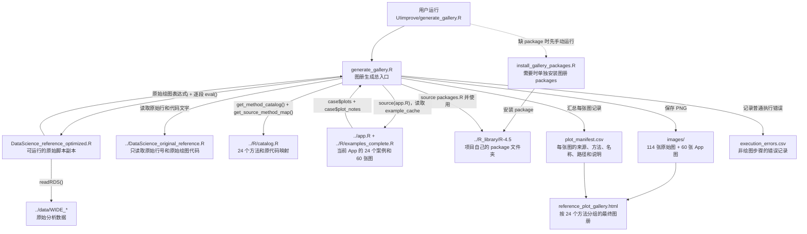
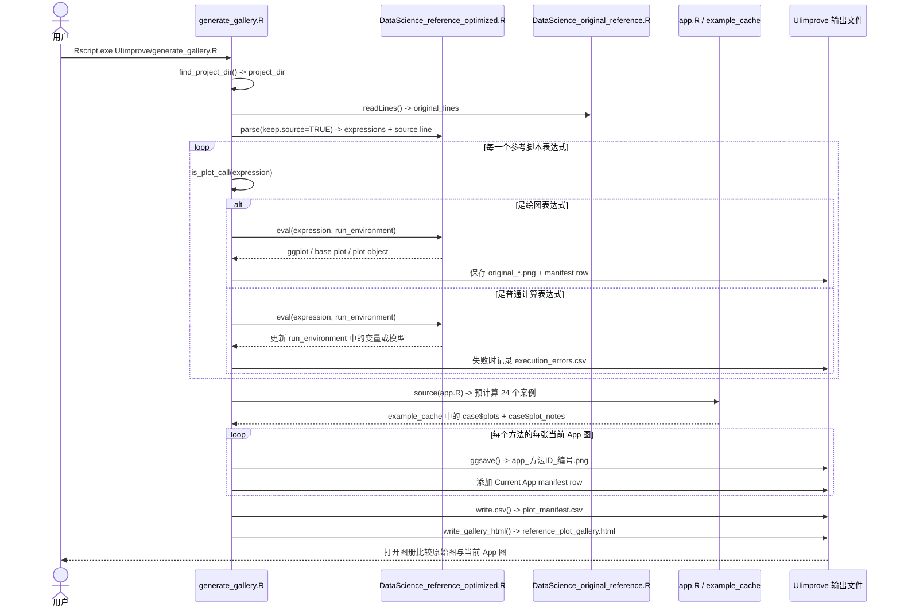
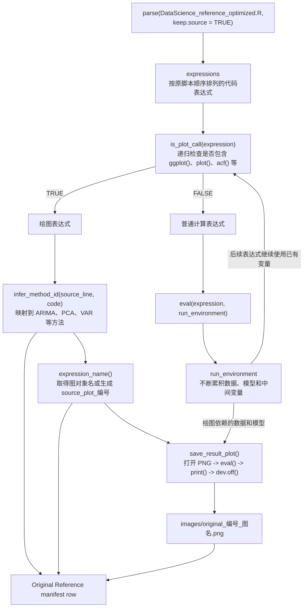
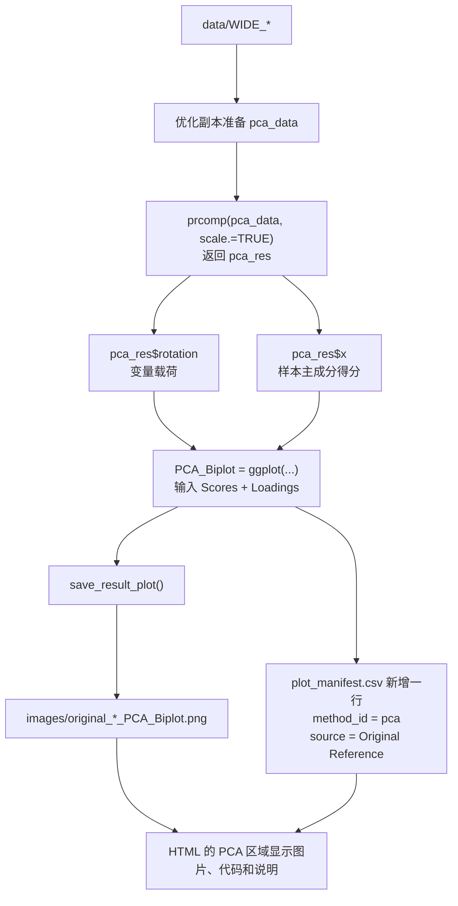
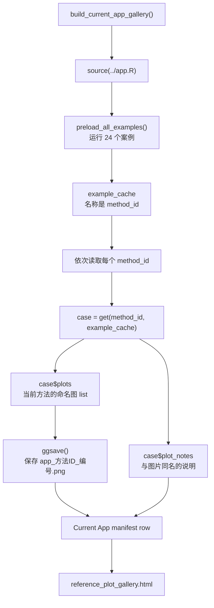
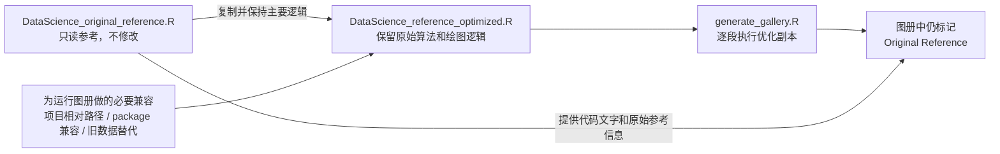
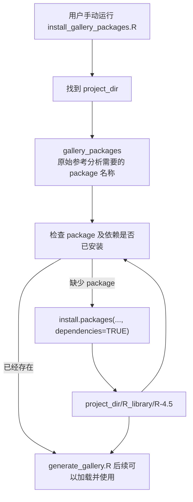
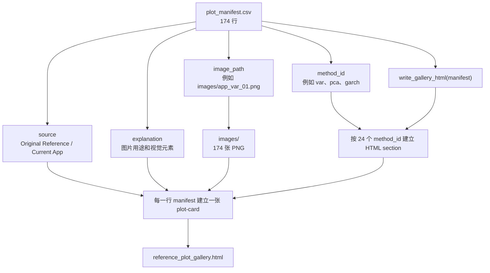
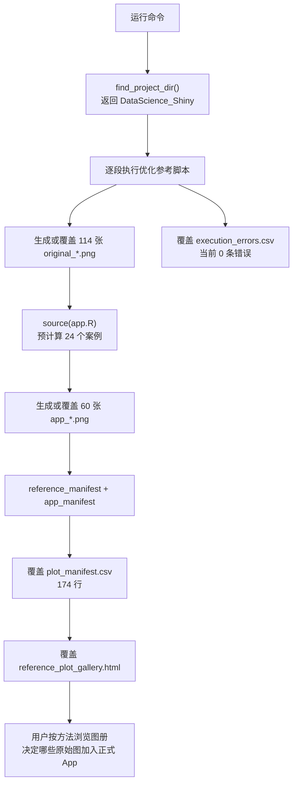

# UIimprove 代码导引图

`UIimprove` 是 Data Science Encyclopedia 的图片筛选工作区。它把原始参考脚本中的图和当前 App 中的图统一导出到一个 HTML 图册，方便逐方法比较。

它不会在用户平时运行 `run_app.R` 时自动执行，也不会直接改变正式 Encyclopedia 页面。只有手动运行 `generate_gallery.R` 时，才会重新生成图册文件。

---

## 1. 文件之间的总关系



### 哪些文件会直接参与图册生成

| 文件 | 类型 | 谁使用它 | 输入 | 返回或产生什么 |
|---|---|---|---|---|
| `generate_gallery.R` | 实际运行入口 | 用户手动运行 | 项目路径、参考脚本、当前 App 案例 | PNG、CSV 和 HTML |
| `DataScience_reference_optimized.R` | 实际运行脚本 | `generate_gallery.R` 逐段执行 | `data/WIDE_*` 和图册 packages | 原始模型对象和原始图 |
| `install_gallery_packages.R` | 独立安装工具 | 用户需要时手动运行 | package 清单、项目 library 路径 | 安装到 `R_library/R-4.5` 的 packages |
| `README.md` | 说明文档 | 用户阅读 | 无 | 简短运行方式 |
| `CODE_GUIDE.md` | 导引文档 | 用户阅读 | 无 | 文件关系和运行路线 |

### 哪些文件是生成结果

| 文件 | 谁生成 | 内容 | 后来给谁使用 |
|---|---|---|---|
| `images/` | `generate_gallery.R` | 174 张 PNG | `reference_plot_gallery.html` |
| `plot_manifest.csv` | `generate_gallery.R` | 174 张图的 metadata | HTML 生成、人工筛选、自动检查 |
| `execution_errors.csv` | `generate_gallery.R` | 非绘图表达式错误 | 调试优化副本；当前结果为 0 条错误 |
| `reference_plot_gallery.html` | `generate_gallery.R` | 24 个方法的图片对比图册 | 用户浏览并选择正式 App 要保留的图 |

---

## 2. `generate_gallery.R`：整个流程如何运行

`generate_gallery.R` 是本文件夹中最重要的文件。它先处理原始参考图，再处理当前 App 图，最后把两类图片合并成一个图册。



### 四个实际执行阶段

```text
Step 1/4: Running original reference plots
Step 2/4: Exporting current App plots
Step 3/4: Writing manifest
Step 4/4: Writing HTML gallery
```

最后一次验证结果：

```text
Original Reference: 114 / 114 张成功
Current App:        60 张成功
Manifest:           174 行
Missing images:     0
Execution errors:   0
```

---

## 3. 原始参考图如何从代码变成 PNG



### 变量如何逐步变化

`run_environment` 是原始脚本执行过程中共享的工作空间。普通表达式创建的变量会留在里面，后面的绘图表达式才能继续使用。

```text
开始：
run_environment = 空环境

执行数据准备后：
run_environment = WIDE 数据 + test1 + merged_dt + test_cad_date + ...

执行模型后：
run_environment = 前面的数据 + fit1 + afit2 + var_model + pca_res + ...

执行绘图后：
run_environment = 前面的数据和模型 + NFP_RISK_Effect + PCA_Biplot + ...
images/          = 新增对应 PNG
manifest         = 新增对应图片记录
```

### 例子：原始 PCA 图如何生成



---

## 4. 当前 App 图片如何进入图册

当前 App 图片不是从 HTML 截图取得，而是直接读取 `app.R` 预计算后的 `example_cache`。



### 例子：导出当前 App 的 VAR 图片

```text
method_id = "var"

get("var", envir = example_cache) 返回：
case$plots      = VAR 动态关系相关图片
case$plot_notes = 每张 VAR 图片下方的教学说明

保存结果：
images/app_var_01.png
images/app_var_02.png
images/app_var_03.png

manifest 中 source：
"Current App"
```

---

## 5. `DataScience_reference_optimized.R` 的作用

这个文件是 `DataScience_original_reference.R` 的可运行副本。图册生成器实际执行的是优化副本，但仍读取原始文件来展示原始代码文字和参考位置。



主要兼容处理：

- 删除原脚本中的硬编码 `setwd("G:/...")`，改读 `DataScience_Shiny/data/WIDE_*`。
- 不连接 Bloomberg，也不依赖图册生成不需要的外部环境。
- `ggbiplot` 无稳定 Windows package 时，使用统计含义相同的 PCA biplot 实现。
- `robust` 示例数据不可用时，使用 `MASS::epil` 建立相同字段结构的 Poisson 教学案例。

---

## 6. `install_gallery_packages.R` 的独立路线

这个文件只负责安装原始参考脚本绘图需要的额外 packages。它不是每次生成图册都必须运行。



它不会把 package 安装到其他项目目录，主要目标是让 VSCode、RStudio 和命令行运行图册时使用同一套项目环境。

---

## 7. 输出文件如何互相引用



`reference_plot_gallery.html` 本身不把图片复制进去，而是通过 `image_path` 引用 `images/` 中的 PNG。因此移动 HTML 时，也要一起保留 `images/` 文件夹。

---

## 8. 一次完整重新生成案例

用户在项目目录运行：

```powershell
& "C:/Program Files/R/R-4.5.2/bin/Rscript.exe" "UIimprove/generate_gallery.R"
```



重新生成只覆盖图册产物，不会修改：

- `DataScience_original_reference.R`
- 正式 App 的案例代码
- `data/WIDE_*`
- 项目外的任何文件

---

## 9. 阅读这个文件夹的推荐顺序

1. 先打开 `reference_plot_gallery.html`，理解这个文件夹最终解决什么问题。
2. 查看 `plot_manifest.csv`，理解 HTML 每张图片的信息来自哪里。
3. 阅读 `generate_gallery.R`，重点看 `build_reference_gallery()`、`build_current_app_gallery()` 和 `write_gallery_html()`。
4. 阅读 `DataScience_reference_optimized.R`，查看原始模型和绘图逻辑。
5. 只有 package 缺失时，再查看或运行 `install_gallery_packages.R`。

