# DataScience Shiny 代码导引图

这份文档不按“函数在哪里定义”来讲，而是按“函数后来在哪里被使用、输入什么、返回什么、结果如何继续传递”来讲。

图中：

- 实线箭头表示下一步会使用上一步的结果。
- 箭头文字表示真正传递的变量或发生的变化。
- `input$...` 是浏览器传给 server 的用户操作。
- `output$...` 是 server 返回给浏览器的网页内容。
- 图已增加字体、节点间距和上下间距，适合在 Markdown 预览中全宽查看。

---

## 1. 全项目运行路线

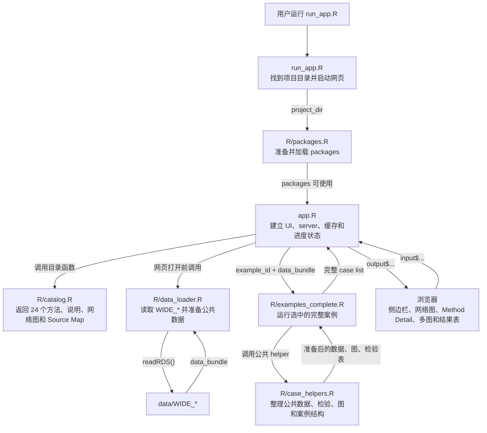

### 核心变量如何传递

| 变量 | 从哪里产生 | 内容示例 | 后来给谁使用 |
|---|---|---|---|
| `project_dir` | `run_app.R / find_project_dir()` | `C:/Users/PC/Desktop/R_git/DataScience_Shiny` | package 路径、启动 `app.R` |
| `data_dir` | `app.R` | `project_dir/data` | `load_wide_data()` |
| `method_catalog` | `get_method_catalog()` | 24 个方法的分类、名称和 ID | 左侧目录、当前方法查找 |
| `method_network` | `get_method_network()` | `nodes` 和 `edges` | Method Navigator |
| `selected_method()` | 用户点击后由 `open_method()` 修改 | `"linear_regression"` → `"var"` | 标题、说明、案例、Source Map |
| `data_bundle` | `load_wide_data(data_dir)` | `list(rates=..., fx=..., ...)` | 全部案例函数 |
| `result` | `run_example(example_id, data_bundle)` | 背景、步骤、图、表、检验、代码、结论 | Method Detail 全部输出 |

---

## 2. `run_app.R`：启动网页

### 文件作用

`run_app.R` 是 VSCode 中推荐运行的第一个文件。它找到正确项目、准备 package 环境并启动 `app.R`；`app.R` 会在 Chrome 打开前预计算全部案例。

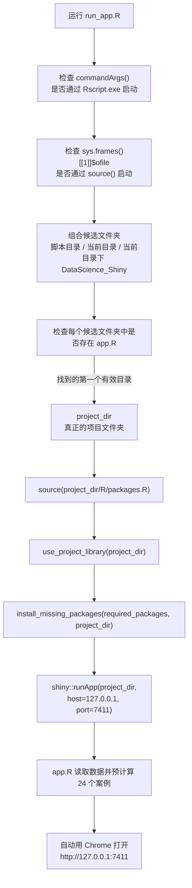

### 输入输出例子

```text
输入：
source("C:/Users/PC/Desktop/R_git/DataScience_Shiny/run_app.R")

find_project_dir() 返回：
"C:/Users/PC/Desktop/R_git/DataScience_Shiny"

最后使用：
shiny::runApp(project_dir, host = "127.0.0.1", port = 7411)
```

---

## 3. `R/packages.R`：项目 package 环境

### 文件作用

这个文件让 VSCode 使用项目自己的 `R_library/R-4.5`。以后 `app.R` 调用 `ggplot2::ggplot()`、`DT::datatable()` 等函数时，R 才知道去哪里寻找这些 packages。

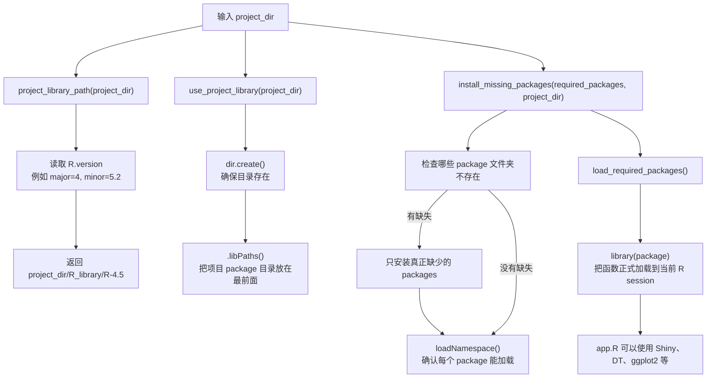

### 变量变化例子

```text
启动前 .libPaths():
C:/Program Files/R/R-4.5.2/library

use_project_library(project_dir) 运行后：
C:/Users/PC/Desktop/R_git/DataScience_Shiny/R_library/R-4.5
C:/Users/PC/Desktop/R_git/DataScience_Shiny/R_library
C:/Program Files/R/R-4.5.2/library
```

项目目录排在最前面，所以网页优先使用本项目已经安装好的 package。

---

## 4. `R/data_loader.R`：读取和准备数据

### 文件作用

这个文件把十个 `WIDE_*` 文件读成 `data_bundle`，并准备多个案例共同使用的 CAD 市场数据。

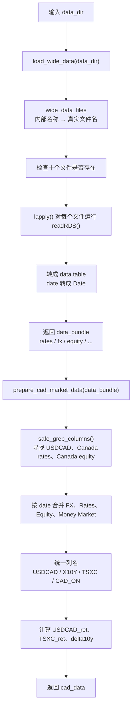

### 数据传递例子

```text
load_wide_data(data_dir)
    ↓
data_bundle$fx       = 完整外汇数据库
data_bundle$rates    = 完整利率数据库
data_bundle$equity   = 完整股票数据库

prepare_cad_market_data(data_bundle)
    ↓
cad_data = date + USDCAD + X10Y + TSXC + CAD_ON
           + USDCAD_ret + TSXC_ret + delta10y

cad_data 后来被 Linear Regression、Correlation、ARIMA、GARCH、
PCA、Bayesian Scenario 等案例继续使用。
```

---

## 5. `R/catalog.R`：网页方法说明和导航数据

### 文件作用

这个文件不运行模型。它回答四个问题：网页有哪些方法、每个方法怎么解释、原脚本代码映射到哪里、网络图如何连接。

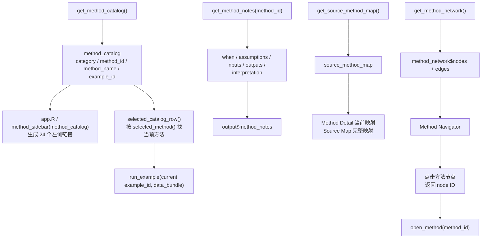

### `method_id` 如何把不同页面连接起来

```text
method_id = "var"

method_catalog:
显示名称 = VAR
分类 = Time Series
example_id = var

method_network:
节点 id = var
节点 method_id = var

source_method_map:
原 DataScience.R 中 VAR 代码段 → method_id = var

因此点击 VAR 后，目录、详情、案例和 Source Map 都会指向同一个方法。
```

---

## 6. `R/case_helpers.R`：公共案例工具

### 文件作用

这个文件把多个案例重复使用的数据准备、模型工具、图表工具和返回格式集中起来。它不会自己决定运行哪个方法，而是被 `examples_complete.R` 中的案例函数调用。

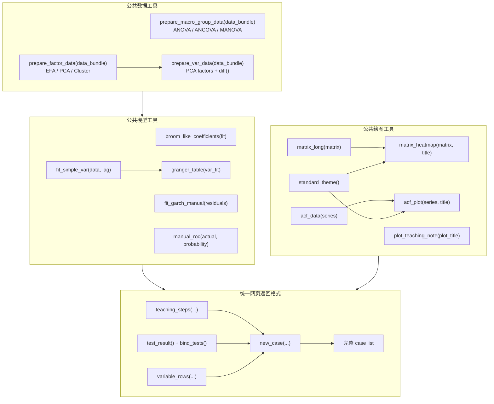

### 例子：VAR 如何使用 helper

```text
case_var(data_bundle)
    ↓ prepare_var_data(data_bundle)
var_data = delta10y + ML1 + ML2 + ML3 的一阶差分
    ↓ fit_simple_var(var_data, lag = 2)
var_fit = 4 条带两阶滞后的回归方程
    ↓ granger_table(var_fit)
granger = 每个因子是否增加 delta10y 预测信息
    ↓ new_case(...)
返回 VAR 页面需要的 plots、tables、tests 和 conclusion
```

---

## 7. `R/examples_complete.R`：24 个完整案例

### 文件作用

`run_example()` 是统一入口。它收到 `example_id` 后，只运行对应案例，再把结果统一交给 `new_case()`。

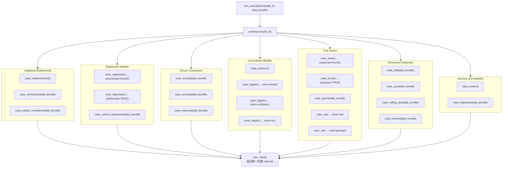

### 每个案例返回什么

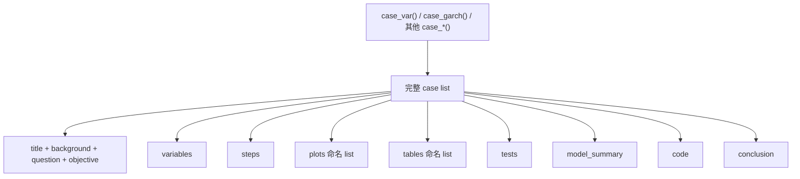

---

## 8. `app.R`：用户操作如何改变网页

### 文件作用

`app.R` 把其他文件的函数连接到浏览器。UI 定义页面有哪些位置；server 定义点击后哪些变量改变，以及哪些输出重新生成。

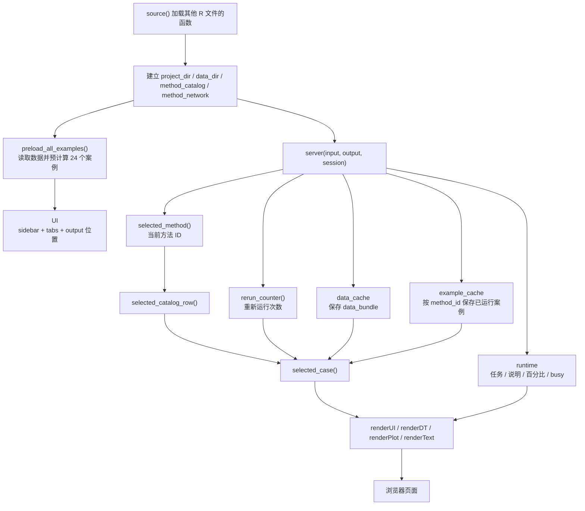

### `reactiveVal()` 和 `reactive()` 的大白话例子

```text
最开始：
selected_method() = "linear_regression"
selected_catalog_row() = Linear Regression 那一行
selected_case() = Linear Regression 案例

点击 VAR 后：
open_method("var")
    ↓
selected_method("var")
    ↓ 因为 selected_catalog_row() 使用了 selected_method()
selected_catalog_row() 自动重新计算为 VAR 那一行
    ↓ 因为 selected_case() 使用了 selected_catalog_row()
selected_case() 直接读取启动时准备好的 VAR 缓存
    ↓
所有使用 selected_case() 的图、表和文字自动更新成 VAR
```

---

## 9. 首次打开网页：初始运行例子

首次运行 `run_app.R` 时，Terminal 先显示 24 个案例的预计算进度。全部完成后才自动打开 Chrome，因此网页出现后点击方法可以直接显示结果。

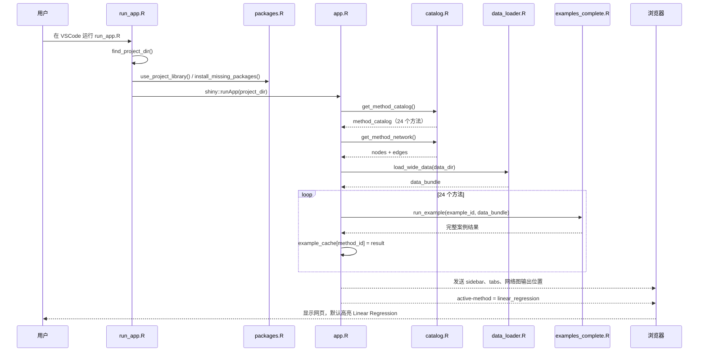

### 初始变量状态

| 变量 | 初始值 | 此时发生了什么 |
|---|---|---|
| `selected_method()` | `"linear_regression"` | 左侧默认高亮 Linear Regression |
| `rerun_counter()` | `0` | 尚未点击重新运行 |
| `runtime$percent` | `100` | 全部案例已经准备完成 |
| `data_cache` | 包含 `bundle` | 十个 WIDE_* 已经读取一次 |
| `example_cache` | 包含 24 个方法结果 | 点击方法时直接读取对应结果 |

---

## 10. 后续输入例子一：点击左侧 VAR

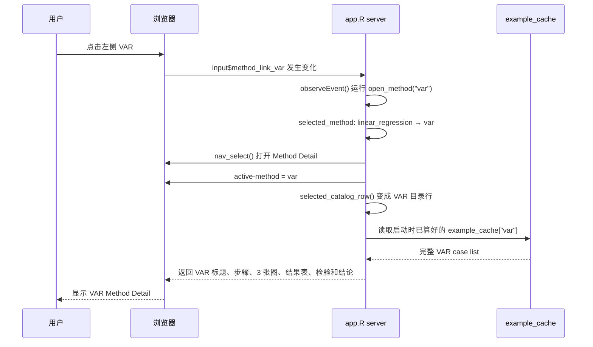

### 变量如何变化

```text
selected_method(): "linear_regression" → "var"
runtime$percent: 100 → 100
data_cache: 保持已有 bundle
example_cache: 保持已有 24 个案例结果
当前 tab: Method Navigator → Method Detail
```

第一次和之后再次点击 VAR 时，`example_cache` 都已经存在 `"var"`，所以直接返回缓存，不重新拟合。

---

## 11. 后续输入例子二：点击网络图中的 ARIMA

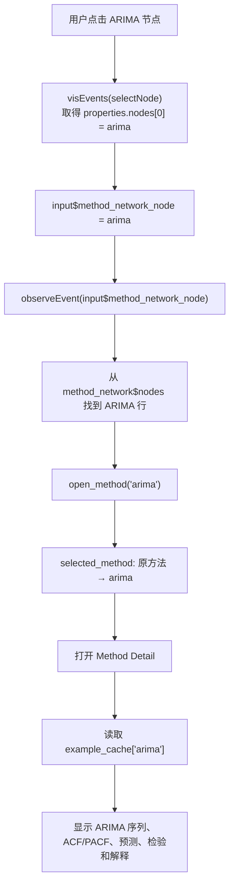

非方法节点没有 `method_id`。例如点击 “Forecasting” 只会高亮网络关系，不会错误打开 Method Detail。

---

## 12. 后续输入例子三：点击 `Re-run case`

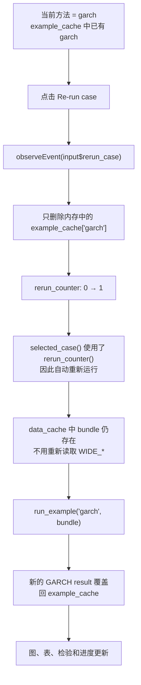

重新运行只清除一个方法的内存缓存，不会删除磁盘文件，也不会清除其他方法的缓存。

---

## 13. `DataScience_optimized.R`：不用网页时的脚本式入口

### 文件作用

这个文件使用与网页相同的数据函数和案例函数，但按普通 R 脚本从上到下运行，适合在 VSCode/RStudio 中查看对象。

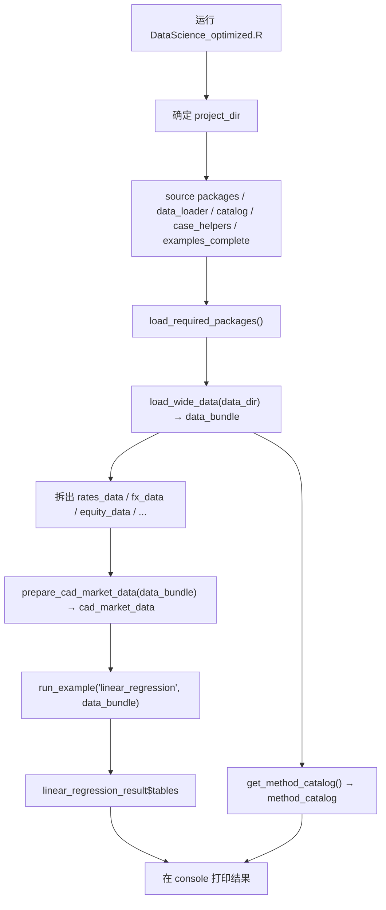

它不会创建网页，也不会使用 Shiny 的 `input`、`output`、`reactive()` 或缓存。

---

## 14. 其他 R 文件的角色

这些文件保留在项目中，但不属于当前网页的实际运行链：

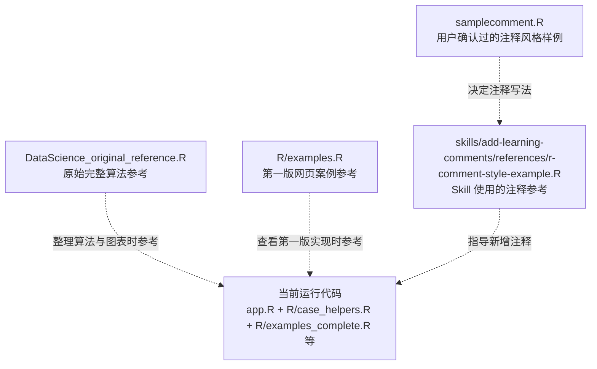

- `DataScience_original_reference.R` 不会被 `app.R` 执行。
- `R/examples.R` 不会被当前 `app.R` source。
- `samplecomment.R` 和 Skill reference 只用于注释风格，不参与网页计算。

### `DataScience_original_reference.R` 路线图

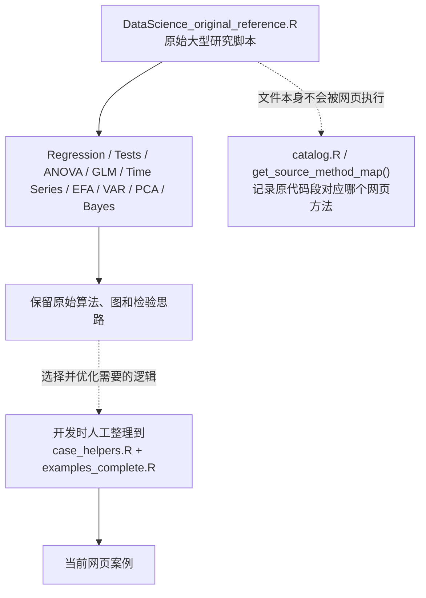

这个文件的输出不会直接传给 `app.R`。它的作用是保留原始研究过程，供以后补案例或核对算法。

### `R/examples.R` 路线图

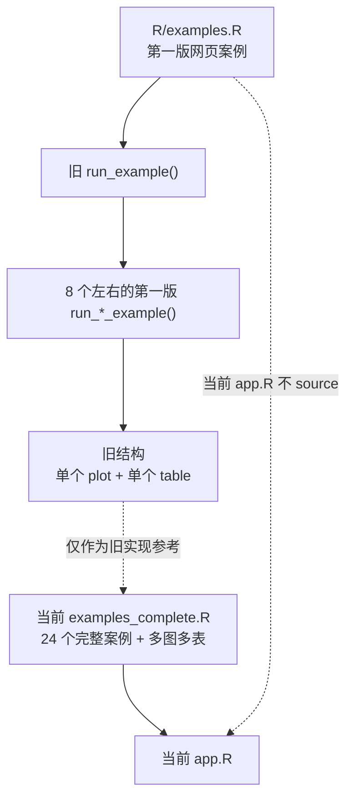

旧文件保留是为了对照第一版写法；当前运行入口已经改成 `examples_complete.R`。

### `samplecomment.R` 路线图

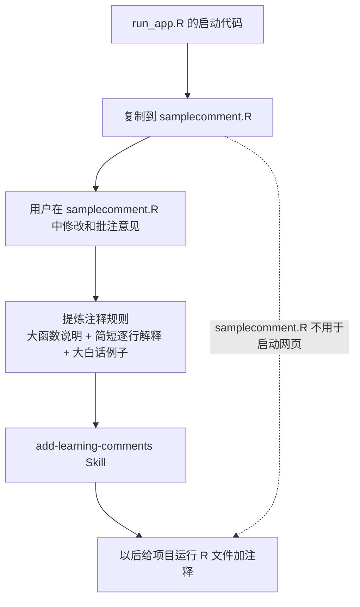

### Skill 中两个 R reference 的路线图

这里包括：

- `skills/add-learning-comments/references/r-comment-style-example.R`
- `skills/add-learning-comments/references/r-shiny-structural-comment-example.R`

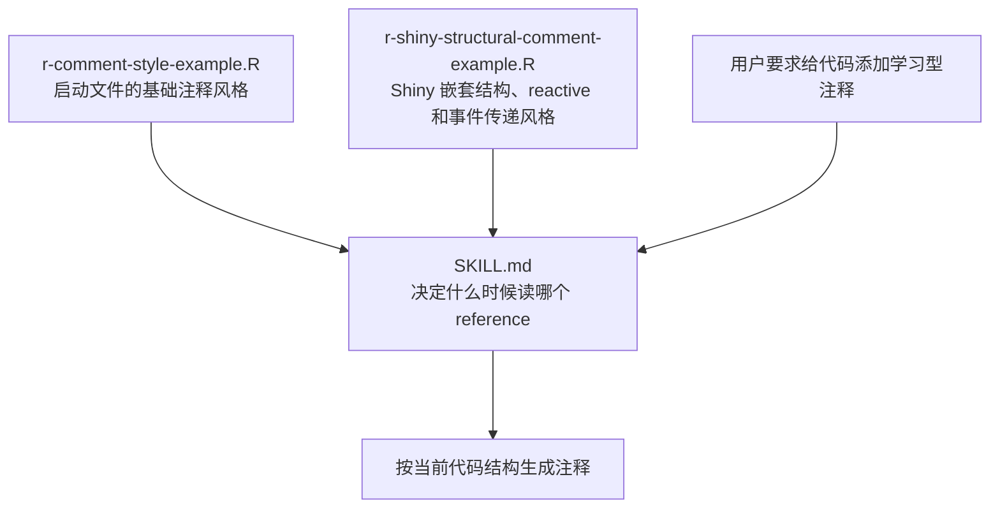

这两个 reference 只给 Codex 展示写法，不会被 R 执行，也不会改变网页变量。

---

## 15. 新增一个方法时，结果如何进入网页

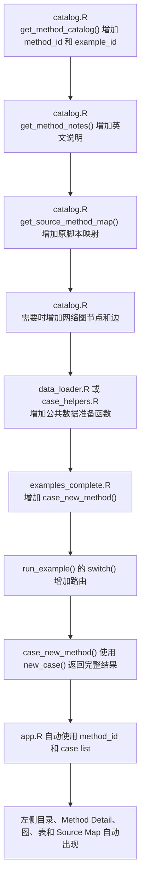

新增案例应至少返回：

- 背景、研究问题和学习目标；
- 当前案例变量解释；
- 分析步骤；
- 至少一张真实图；
- 至少一张结果表；
- 检验或描述性诊断；
- 可复用代码和最终结论。
