# YieldCurve Trader Dashboard 代码线路图

这份线路图按“代码实际如何运行”来讲，而不是只列出函数定义。

- `input$...`：用户在浏览器中选择或输入的值。
- `reactive()`：输入变化后，会通知依赖它的计算重新运行。
- `output$...`：server 计算完成后返回给浏览器的图、表或文字。
- **正式零息分析**来自 `ZERORATE_CURVE`；**历史 Proxy** 来自 `WIDE_RATES`。

---

## 1. 全项目运行路线

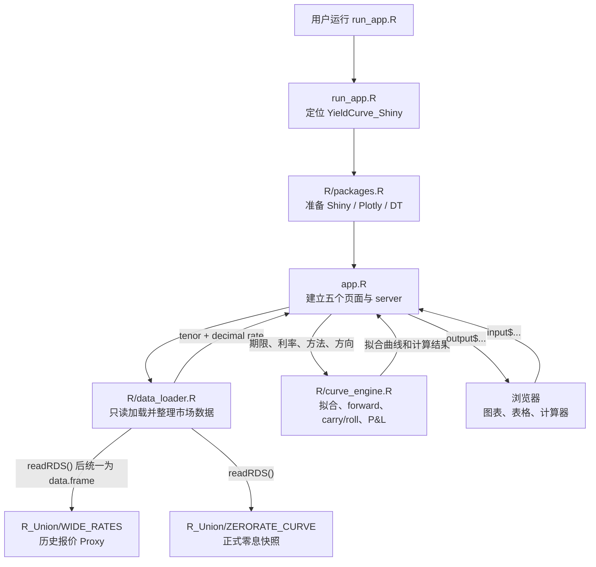

`R_Union/YieldCurve.R` 是原始参考脚本，不在当前 Shiny 运行路线中，也不会被网页修改。

---

## 2. 启动时序

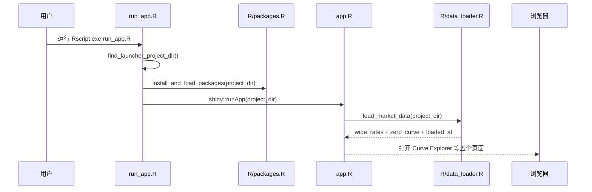

启动后，`market()` 保存本次读取的数据。点击 **Refresh local RDS** 后，
`market(): 旧数据 -> 新读取数据`，所有依赖它的曲线列表和结果跟着刷新。

---

## 3. 数据读取与日期回退

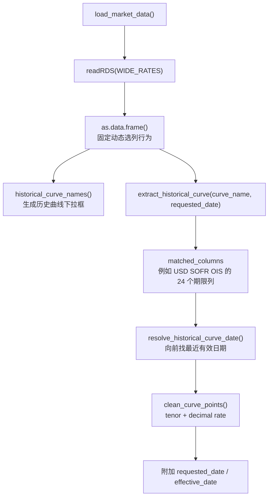

具体例子：

```text
用户请求：EUR ESTR OIS，2025-10-22
该日有效期限点不足
resolve_historical_curve_date() 向前寻找
返回：最近一个至少有 3 个有效点的 effective_date
网页显示：Requested: 2025-10-22 | Effective: 实际日期
```

这一步也修复了原来的错误：`data.table` 不再把 `matched_columns` 错认为真实列名。

---

## 4. Curve Explorer 与共享拟合路线

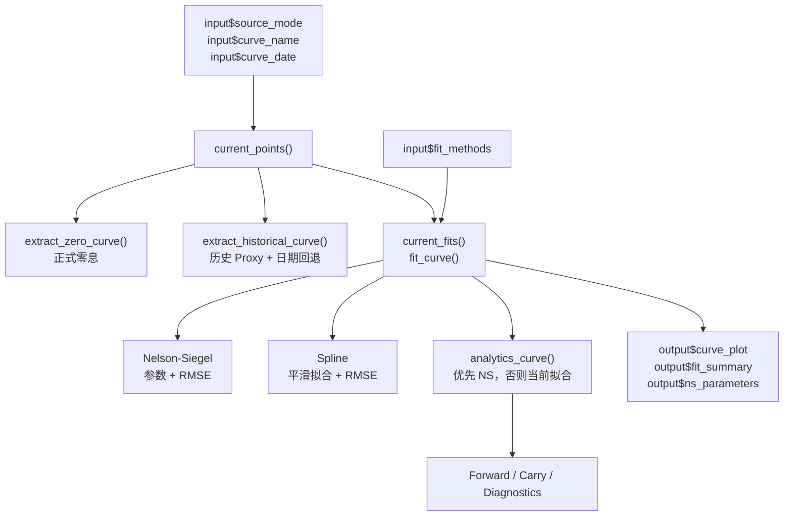

关键点：Forward、Carry 和 Diagnostics 不各自重新拟合，而是共用
`analytics_curve()`，因此同一次选择在不同页面使用同一条曲线。

---

## 5. 五个页面如何响应输入

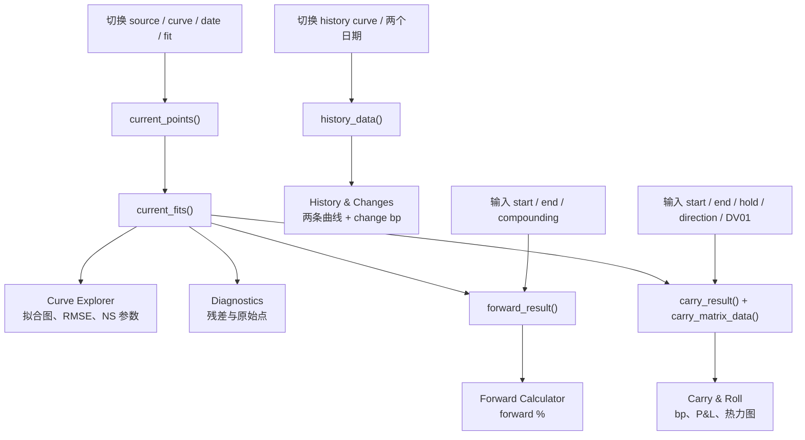

### 具体操作例子

```text
Curve Explorer:
source_mode = zero
curve_name = USD UNITED STATES OIS
fit_methods = Nelson-Siegel + Spline
-> current_points() 返回 25 个点
-> current_fits() 返回两种拟合
-> 曲线图、RMSE 与参数表刷新

Forward Calculator:
forward_start = 1
forward_end = 5
compounding = annual
-> calculate_forward(analytics_curve(), 1, 5, "annual")
-> Forward Rate 卡片与结果表刷新

Carry & Roll:
carry_start = 0
carry_end = 5
carry_hold = 0.25
direction = Receive Fixed
dv01 = 10000
-> calculate_carry_roll() 返回 carry / roll / total bp
-> calculate_dv01_pnl(total_bp, 10000) 返回估算金额
-> 卡片、矩阵与热力图刷新
```

---

## 6. 核心变量传递表

| 变量 | 从哪里产生 | 内容示例 | 后来影响什么 |
|---|---|---|---|
| `market()` | `load_market_data()` | `wide_rates`, `zero_curve`, `loaded_at` | 所有曲线列表与页面结果 |
| `current_points()` | 当前 source、curve、date | `tenor + decimal rate` | 拟合、曲线图、Diagnostics |
| `current_fits()` | `fit_curve()` | NS/Spline 结果列表 | RMSE、参数、`analytics_curve()` |
| `analytics_curve()` | 优先选中的 NS 拟合 | `yield_curve_fit` | Forward、Carry、Diagnostics |
| `history_data()` | 两个历史曲线点按 tenor 合并 | base、compare、change bp | History 图和表 |
| `effective_date` | 日期回退函数 | 最近有效历史日期 | 页面日期提示与历史口径 |
| `carry_matrix_data()` | 多个 tenor × hold 组合 | carry、roll、total、P&L | Carry 表格和热力图 |

---

## 7. Sidebar 具体操作案例

> 注意：案例 A、B、F 仍对应当前 Curve Explorer / Diagnostics。案例 C、D、E 保留为早期版本
> 的演进记录，其中旧 input 名称不再由当前 app 使用。当前 History、Forward、Carry 与 Curve Trade
> 的可执行路线请直接阅读第 8 节案例 G-K。

这一章从用户真正点击 sidebar 开始讲。每个案例都写明：

1. sidebar 选择了什么；
2. 哪个 `input$...` 改变；
3. 哪些 reactive 和函数重新运行；
4. 返回什么真实结果；
5. 页面哪些区域跟着刷新。

### 案例 A：Curve Explorer 选择正式 USD OIS 曲线

#### Sidebar 输入

```text
Analytics source = Zero-rate snapshot (official analytics)
Curve             = USD UNITED STATES OIS
Curve fits        = Nelson-Siegel + Spline
```

这些控件分别变成：

```text
input$source_mode = "zero"
input$curve_name  = "USD UNITED STATES OIS"
input$fit_methods = c("nelson_siegel", "spline")
```

#### 实际运行路线

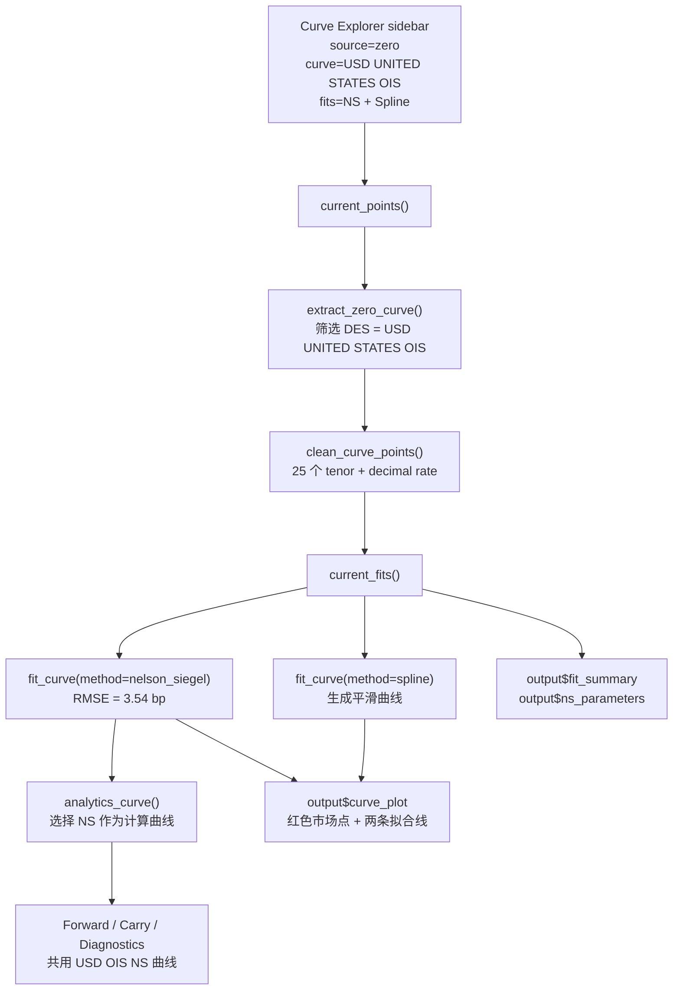

#### 用户看到的结果

```text
市场点数量：25
Nelson-Siegel RMSE：3.54 bp
页面提示：Zero-rate analytics
Effective date：Snapshot source: no historical date
```

Curve Explorer 的曲线图、拟合误差表、NS 参数表刷新；Forward、Carry 和
Diagnostics 也立刻改为使用这条 USD OIS 曲线。

---

### 案例 B：Curve Explorer 选择历史 EUR ESTR，并发生日期回退

#### Sidebar 输入

```text
Analytics source = Historical market quotes (proxy)
Curve             = EUR ESTR OIS
Date              = 2025-10-22
Curve fits        = Nelson-Siegel + Spline
```

#### 实际运行路线

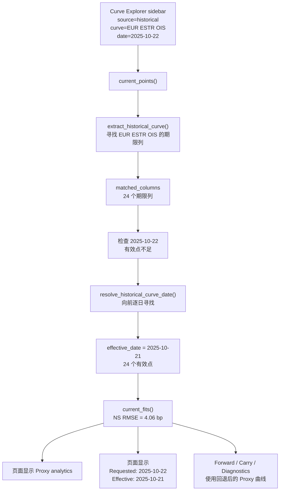

#### 用户看到的结果

```text
Requested date：2025-10-22
Effective date：2025-10-21
市场点数量：24
Nelson-Siegel RMSE：4.06 bp
1Y -> 5Y Forward：2.114%
0Y -> 5Y、持有 3M、Receive Fixed 的 Carry + Roll：5.90 bp
```

这里最重要的是：日期缺数据不会再使多个页面一起报错，而是明确回退并显示实际日期。

---

### 案例 C（历史版本）：History & Changes 比较 USD SOFR OIS 两个日期

#### Sidebar 输入

```text
Historical curve = USD SOFR OIS
Base date        = 2025-09-23
Compare date     = 2025-10-22
```

对应值：

```text
input$history_curve  = "USD SOFR OIS"
input$history_date_1 = "2025-09-23"
input$history_date_2 = "2025-10-22"
```

#### 实际运行路线

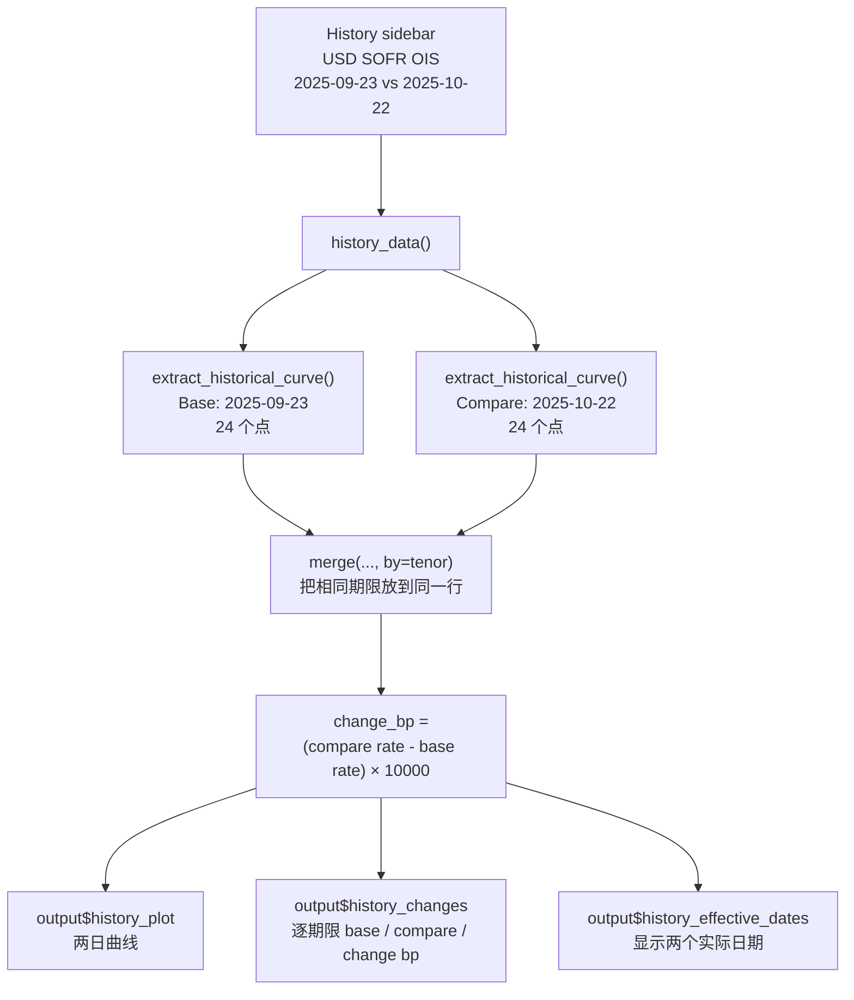

#### 用户看到什么

- 图中同时出现 `2025-09-23` 和 `2025-10-22` 两条 USD SOFR OIS 曲线。
- 表格每行代表一个共同期限，并显示该期限利率变化的 bp。
- 两个日期均有有效数据，因此 Effective Date 与用户选择一致。

History 页面使用自己的 `history_data()`，不会改变 Curve Explorer 当前用于
Forward 和 Carry 的 `analytics_curve()`。

---

### 案例 D（历史版本）：Forward Calculator 计算 USD OIS 的 1Y → 5Y Forward

这个页面没有曲线选择 sidebar。它使用 Curve Explorer 当前已经选好的
`analytics_curve()`。因此先在 Curve Explorer 选择：

```text
source = Zero-rate snapshot
curve  = USD UNITED STATES OIS
```

然后在 Forward Calculator 输入：

```text
Forward start = 1
Forward end   = 5
Compounding   = Annual
```

#### 实际运行路线

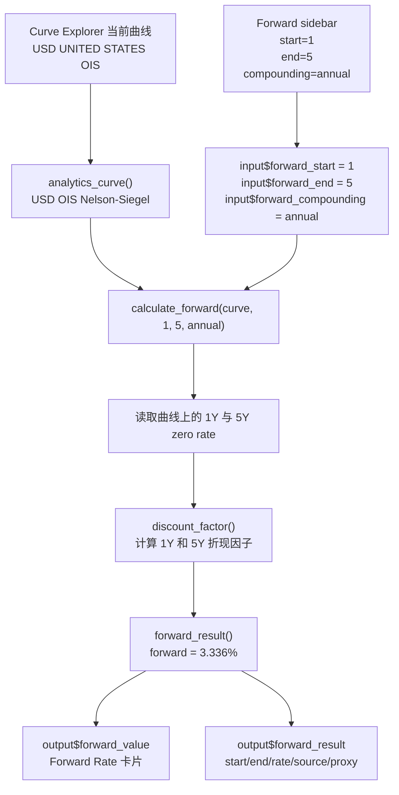

#### 用户看到的结果

```text
Forward Rate：3.336%
Start：1 year
End：5 years
Compounding：annual
Source：ZERORATE_CURVE | USD UNITED STATES OIS
Proxy：FALSE
```

若回到 Curve Explorer 把曲线切换成 `AUD AUSTRALIA (vs. 6M Bank Bills)`，
Forward sidebar 不需要重新输入，`analytics_curve()` 改变后结果自动变为约 `4.549%`。

---

### 案例 E（历史版本）：Carry & Roll 计算 Receive Fixed 与 Pay Fixed

先在 Curve Explorer 选择：

```text
source = Zero-rate snapshot
curve  = USD UNITED STATES OIS
```

Carry & Roll sidebar 输入：

```text
Trade start = 0
Trade end   = 5
Hold period = 3M
Direction   = Receive Fixed
DV01 per bp = 10000
```

#### 实际运行路线

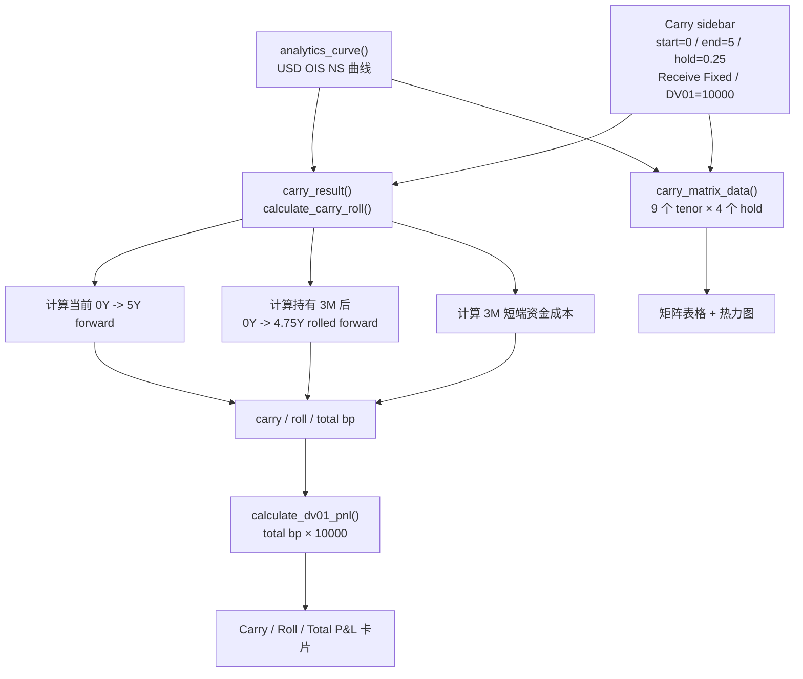

#### 用户看到的结果

```text
Receive Fixed:
Total Carry + Roll = -6.35 bp
Estimated P&L      = -63,538（使用 DV01 = 10,000）
```

把 sidebar 的 `Direction` 改成 `Pay Fixed` 后：

```text
input$carry_direction: "Receive Fixed" -> "Pay Fixed"
direction_sign(): +1 -> -1
Carry、Roll、Total bp 与 P&L 的符号全部反转
热力图和矩阵也一起刷新
```

---

### 案例 F：Diagnostics 如何跟随 Curve Explorer，以及 Refresh 如何传播

Diagnostics 没有自己的 sidebar。它始终检查 Curve Explorer 当前选择产生的
`current_points()` 和 `analytics_curve()`。

例如 Curve Explorer 选择：

```text
source = Historical market quotes (proxy)
curve  = AUD COR OIS
date   = 2025-10-22
fit    = Nelson-Siegel
```

#### 实际运行路线

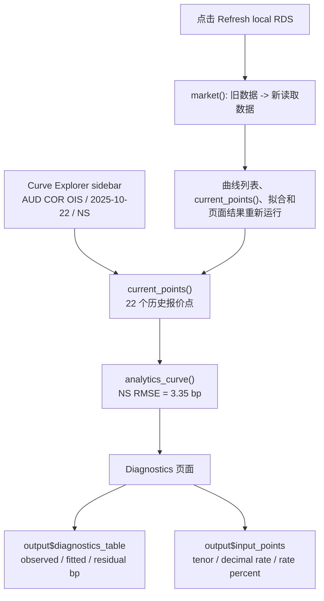

#### 用户看到的结果

```text
AUD COR OIS Effective Date：2025-10-22
市场点数量：22
Nelson-Siegel RMSE：3.35 bp
Diagnostics 表中每一行显示：
tenor、observed_percent、fitted_percent、residual_bp
```

点击 Refresh 后，网页重新只读加载 `WIDE_RATES` 和 `ZERORATE_CURVE`。
如果源文件内容没变，数值保持一致；如果源文件已更新，所有依赖当前曲线的页面一起刷新。

---

## 8. 当前版本新增交互案例

本节描述当前版本的多选 History、独立计算器曲线和 Curve Trade。下面数值来自
`tests/validation_matrix.R` 对真实本地 RDS 的实际运行结果。

### 案例 G：History 同时比较三条曲线和三个日期

```text
input$history_curves = USD SOFR OIS, AUD COR OIS, EUR ESTR OIS
input$history_dates = 2025-09-23, 2025-10-21, 2025-10-22
input$history_base_date = 2025-09-23
```

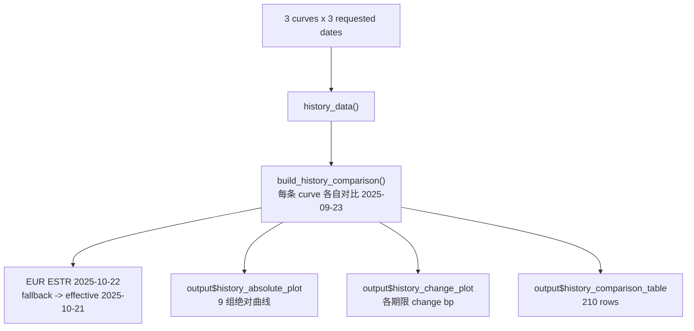

真实汇总结果：`USD SOFR OIS` 在 `2025-10-22` 相对 base date 平均变化
`-10.736 bp`；`AUD COR OIS` 为 `-5.288 bp`；EUR ESTR 请求最新日时自动回退。

### 案例 H：Forward 独立选择 EUR 曲线

```text
input$forward_source_mode = zero
input$forward_curve_name = EUR EUROZONE (vs. 6M EURIBOR)
input$forward_fit_method = spline
input$forward_start = 1
input$forward_end = 5
```

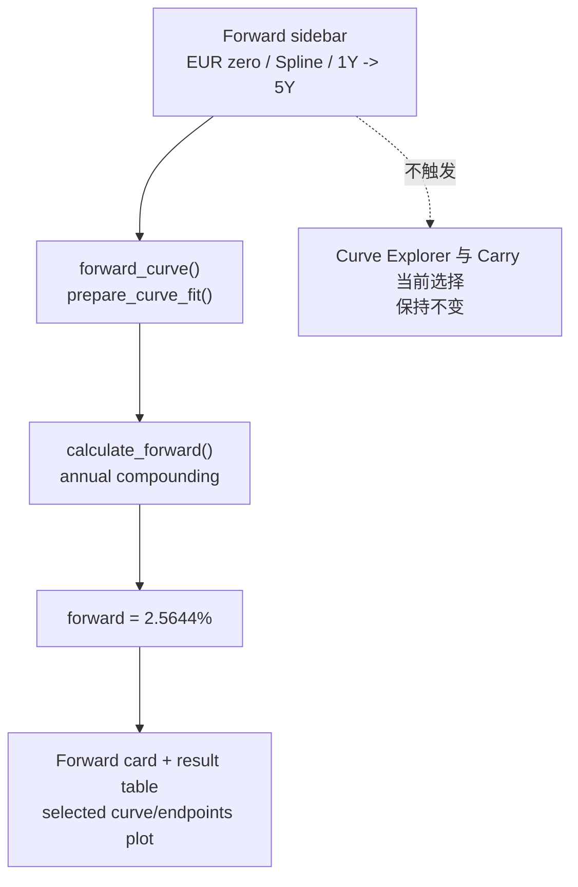

Forward 是当前曲线隐含的远期利率，不是利率预测。端点图用于确认计算使用的是哪条曲线和
哪两个期限。

### 案例 I：Carry 独立选择 AUD 曲线并读取四类图

```text
input$carry_curve_name = AUD AUSTRALIA (vs. 6M Bank Bills)
input$carry_start = 0
input$carry_end = 5
input$carry_hold = 0.25
input$carry_direction = Receive Fixed
input$dv01 = 10000
```

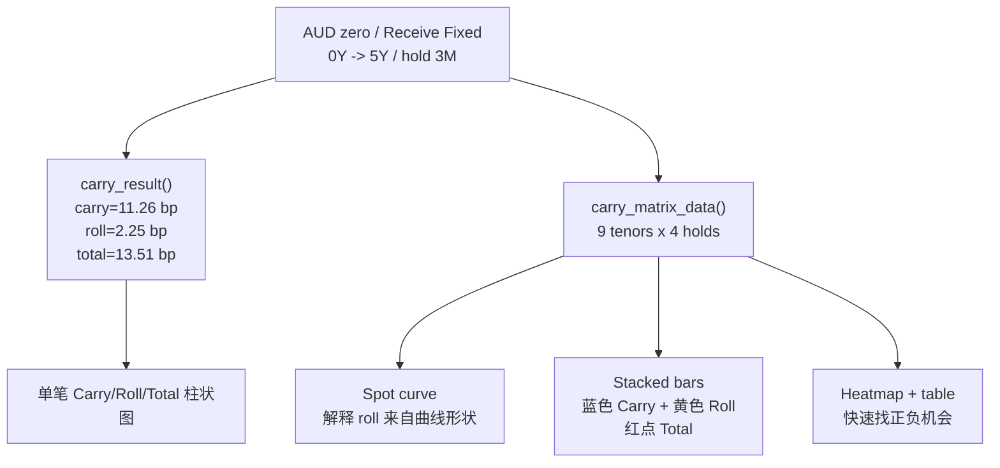

Carry 是持有期间收入减短端资金成本；Roll 是曲线保持不变时交易向短期限移动造成的变化。
图中 Total 是两者相加，金额 P&L 再乘用户输入 DV01。

### 案例 J：点击计算 2s10s Steepener

```text
input$trade_structure = steepener
short = 2Y, long = 10Y, hold = 3M
risk budget = 10000
默认 legs = Receive Fixed 2Y DV01 10000 + Pay Fixed 10Y DV01 10000
点击 Calculate Curve Trade
```

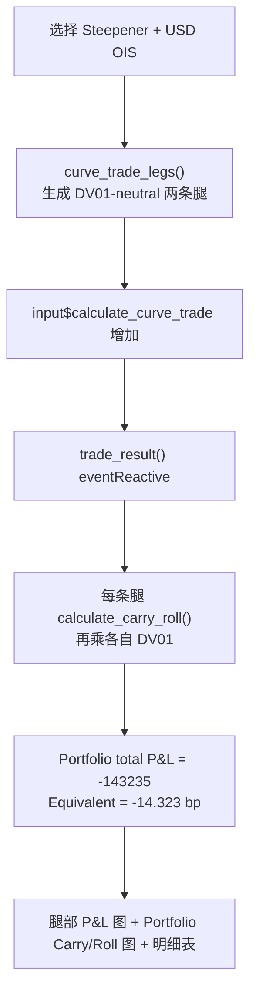

Steepener 的方向是收短端固定、付长端固定。Flattener 使用相反方向，因此相同输入下真实结果
为 `+143235`，符号正好相反。

### 案例 K：点击计算 2s5s10s Fly

```text
input$trade_structure = long_belly_fly
2Y DV01 = 5000, 5Y DV01 = 10000, 10Y DV01 = 5000
legs = Pay 2Y + Receive 5Y + Pay 10Y
```

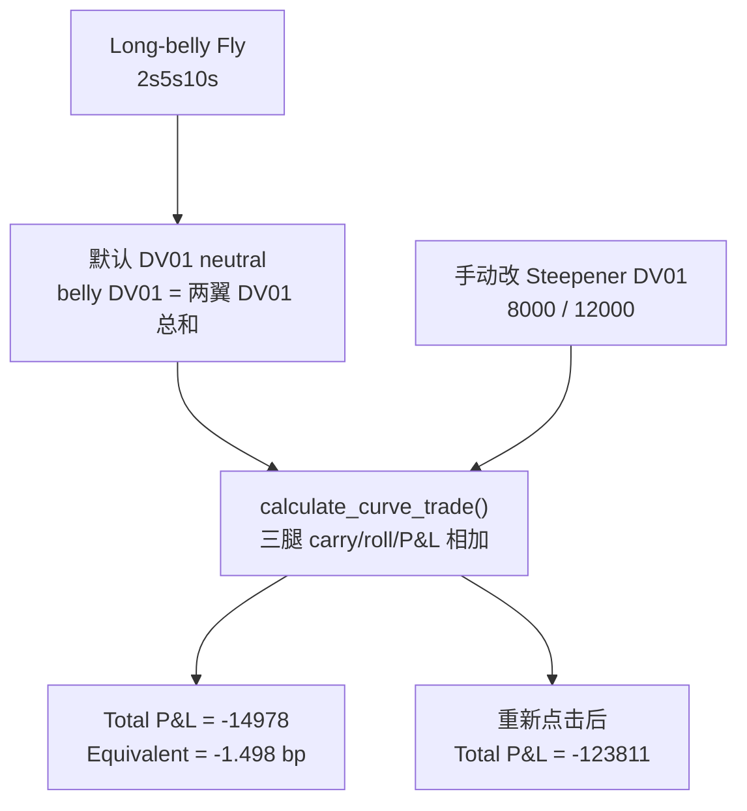

Long-belly Fly 表示收 belly、付两翼；Short-belly Fly 方向相反，真实结果为 `+14978`。
手动 DV01 输入只有在再次点击计算按钮后才进入结果，避免调参数过程中页面不断跳动。

---

## 9. 测试路线

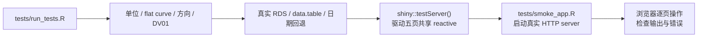

自动测试必须先加载真实网页 packages，确保测试环境与用户实际运行环境一致。
