# YieldCurve Trader Dashboard 代码路线图

这份文档按“代码实际怎么跑”来读项目，而不是按“函数在哪里定义”来罗列。重点是：用户在页面中改了什么 `input$...`，server 如何把它锁进 `applied_*`，最后哪些 `output$...` 图、表、KPI 跟着刷新。

项目当前采用 applied-result 模式：sidebar 输入变化只标记 pending；点击对应按钮后才替换最近一次成功结果。计算失败时保留旧结果，状态区显示 error。

## 1. 全项目运行路线

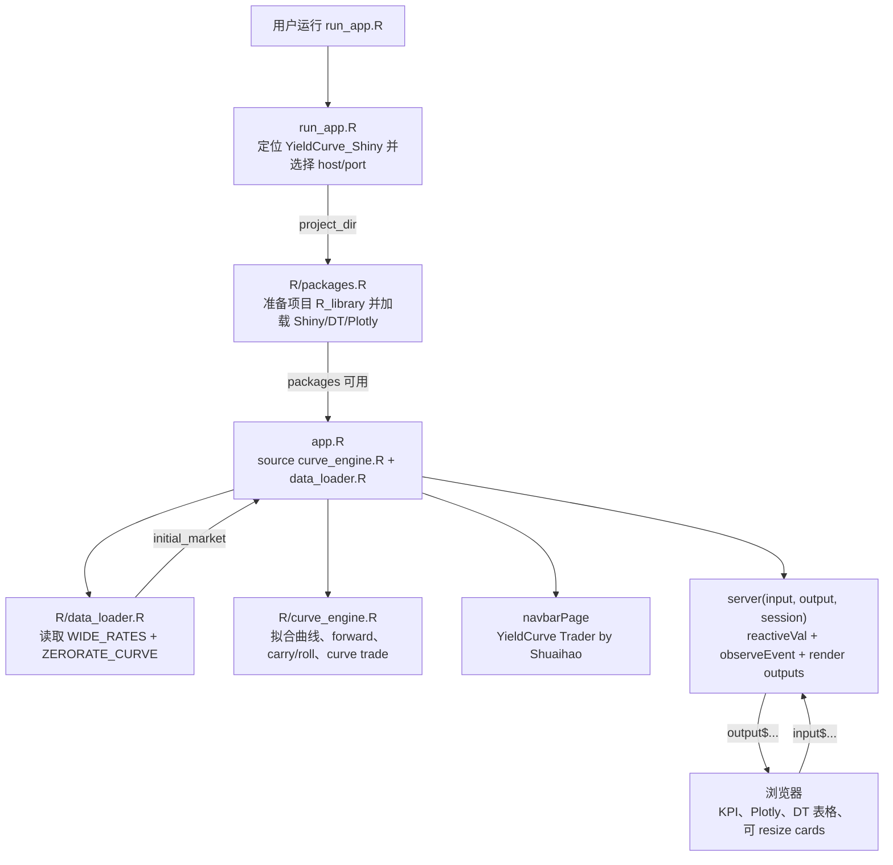

`R_Union/YieldCurve.R` 是早期探索脚本，不在当前 Shiny 运行链路里。当前 app 只读取本地 RDS 数据，不修改原始 RDS 或原始脚本。

## 2. 文件角色

| 文件 | 当前作用 | 谁调用它 | 输出给谁 |
|---|---|---|---|
| `run_app.R` | 找到项目目录，加载 package 管理文件，启动 Shiny | 用户或 Rscript | `shiny::runApp(project_dir)` |
| `R/packages.R` | 设置项目 library，安装/加载必要 packages | `run_app.R`、tests | 当前 R session |
| `app.R` | 定义 UI、server、状态、按钮事件和所有图表输出 | `run_app.R`、`tests/run_tests.R` | 浏览器页面 |
| `R/data_loader.R` | 读取 RDS、规范化 curve/tenor/date，构造历史对比 | `app.R`、tests | `market()`、history data |
| `R/curve_engine.R` | 拟合、forward、carry/roll、DV01 P&L、curve trade | `app.R`、tests | 各 tab 的 applied result |
| `www/styles.css` | Shuaihao branding、dashboard 布局、resize、KPI/table/plot 样式 | 浏览器加载 | 页面视觉效果 |
| `tests/run_tests.R` | 验证计算逻辑和 Shiny server 点击流程 | 开发者运行 | pass/fail |

## 3. 启动时序

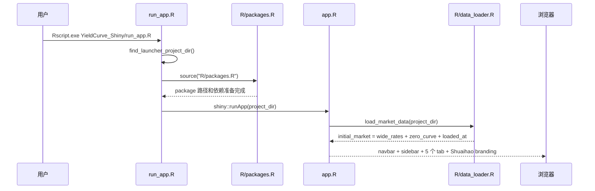

启动后，`market <- reactiveVal(initial_market)` 保存本次读取的数据。点击 `Refresh local RDS` 会重新运行 `load_market_data()` 并替换 `market()`，所有依赖 `market()` 的曲线列表和后续计算都会重新读取。

## 4. 核心状态变量

| 状态变量 | 在哪里创建 | 保存什么 | 影响哪些页面 |
|---|---|---|---|
| `market()` | `server()` 开始处 | `wide_rates`、`zero_curve`、`loaded_at` | 全部 curve/source/date 下拉和计算 |
| `applied_curve()` | `observeEvent(input$apply_curve)` | 最近一次成功应用的 Curve Explorer fit bundle | Curve Explorer、Diagnostics |
| `applied_history()` | `observeEvent(input$run_history)` | 最近一次成功历史对比结果 | History & Changes |
| `applied_forward()` | `observeEvent(input$calculate_forward)` | 最近一次成功 forward 结果 | Forward Calculator |
| `applied_carry()` | `observeEvent(input$calculate_carry)` | 最近一次成功 single trade carry result | Carry & Roll single/KPI |
| `applied_trade()` | `observeEvent(input$calculate_curve_trade)` | 最近一次成功 curve trade portfolio result | Carry & Roll curve trade/KPI |
| `status` | `reactiveValues()` | 每个模块 pending/running/success/error | sidebar status 和按钮反馈 |
| `large_plot_id()` | `register_plot()` 的 open button | 当前打开的大图 id | Open large modal |

## 5. applied-result 模式

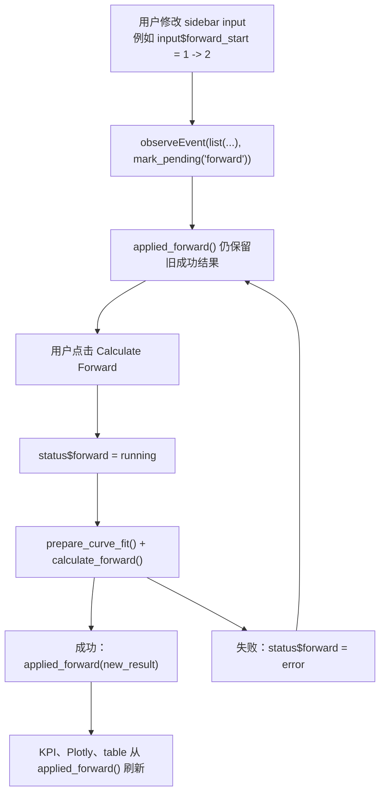

这个模式让交易台更稳定：调输入时页面不会乱跳，只有明确点击按钮后才把新结果作为“当前结果”。

## 6. 数据读取与日期 fallback

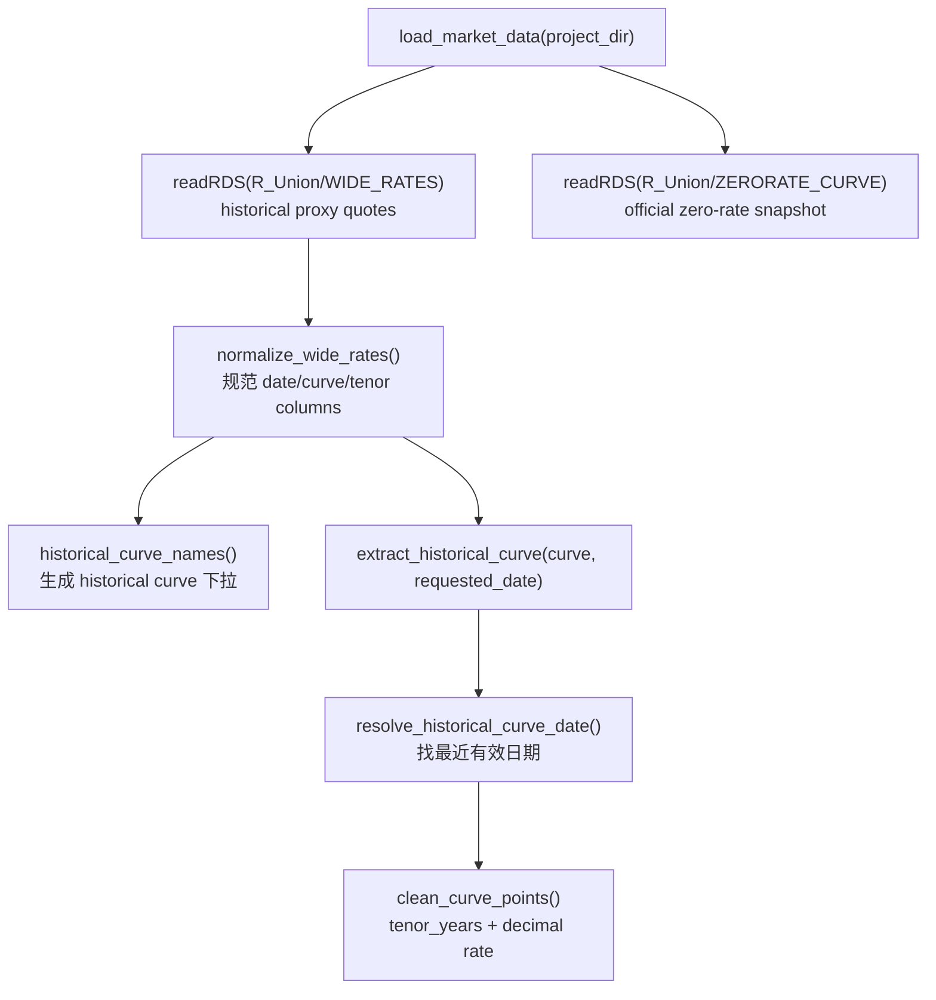

历史 proxy 日期如果没有足够有效点，会前后寻找最近有效日期；距离相同优先较早日期。页面会显示 requested date 和实际 effective/display date，避免把 proxy 结果误认为实时 Bloomberg。

## 7. Curve Explorer：Apply Curve

### 用户操作

```text
input$source_mode = "zero"
input$curve_name = "USD UNITED STATES OIS"
input$fit_methods = c("nelson_siegel", "spline")
点击 input$apply_curve
```

### 运行路线

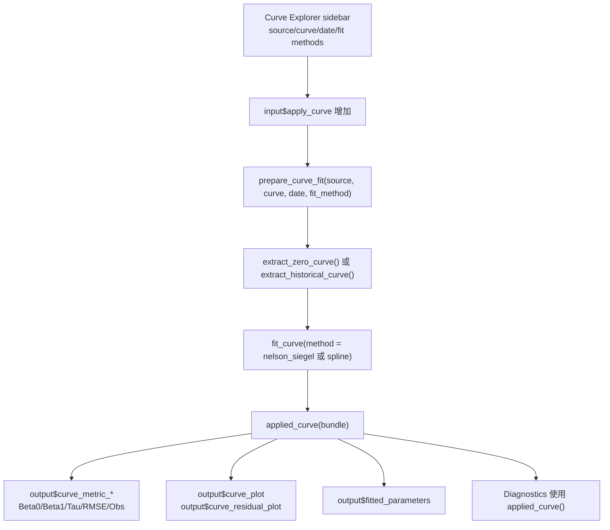

Curve Explorer 是 Diagnostics 的来源。Diagnostics 不单独重新拟合，而是检查最近一次成功 `applied_curve()` 的点、残差和模型路径。

## 8. History & Changes：Run History Comparison

### 用户操作

```text
input$history_curves = c("USD SOFR OIS", "AUD COR OIS")
input$history_base_date = as.Date("2025-09-23")
history_compare_dates() = c("2025-10-22")
点击 input$run_history
```

### 运行路线

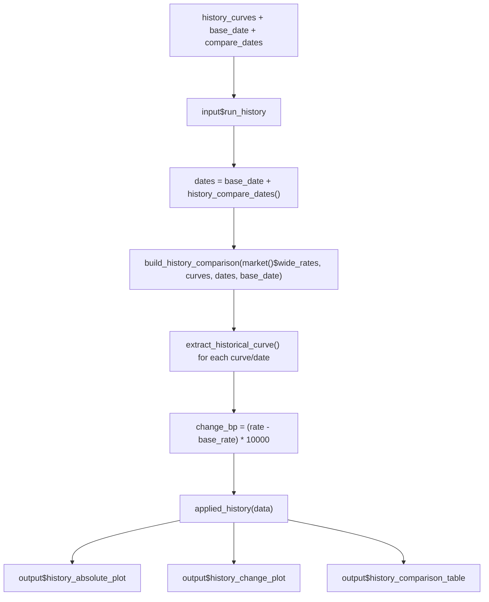

History 最多限制组合数，防止一次运行过多 curve/date。右侧 quote table 用内部滚动，和 absolute plot 保持同 row 等高。

## 9. Forward Calculator：Calculate Forward

### 用户操作

```text
input$forward_source_mode = "zero"
input$forward_curve_name = "EUR EUROZONE (vs. 6M EURIBOR)"
input$forward_fit_method = "spline"
input$forward_start = 1
input$forward_end = 5
input$forward_compounding = "annual"
点击 input$calculate_forward
```

### 运行路线

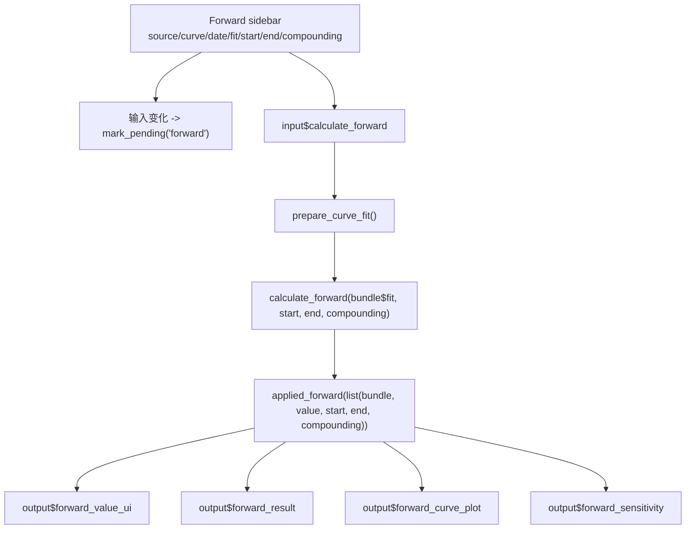

Forward Calculator 有自己的 curve/source/date/fit method，不强制跟随 Curve Explorer。这样用户可以一边保留 Curve Explorer 的诊断对象，一边计算另一条曲线的 forward。

## 10. Carry & Roll：Single Trade

### 用户操作

```text
input$carry_workspace_mode = "single"
input$carry_curve_name = "USD UNITED STATES OIS"
input$carry_start = 0
input$carry_end = 5
input$carry_hold = 0.25
input$carry_direction = "Receive Fixed"
input$dv01 = 10000
点击 input$calculate_carry
```

### 运行路线

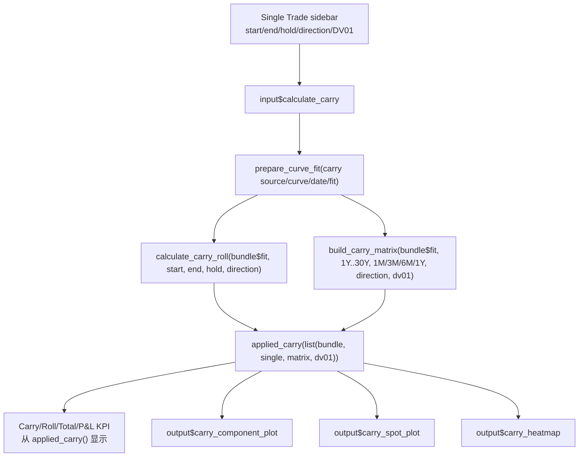

Single 主 decomposition 图固定展示目标 tenors：`1Y, 2Y, 3Y, 5Y, 7Y, 10Y, 15Y, 20Y, 30Y`。Heatmap 行固定为 `1M, 3M, 6M, 1Y`，列固定为同一组主 tenors。

## 11. Carry & Roll：Curve Trade

### 用户操作

```text
input$carry_workspace_mode = "trade"
input$trade_structure = "butterfly"
input$trade_start = 0
input$trade_short_tenor = 2
input$trade_belly_tenor = 5
input$trade_long_tenor = 10
input$trade_hold = 0.25
input$trade_risk_budget = 10000
input$trade_short_dv01 = 5000
input$trade_belly_dv01 = 10000
input$trade_long_dv01 = 5000
点击 input$calculate_curve_trade
```

### 运行路线

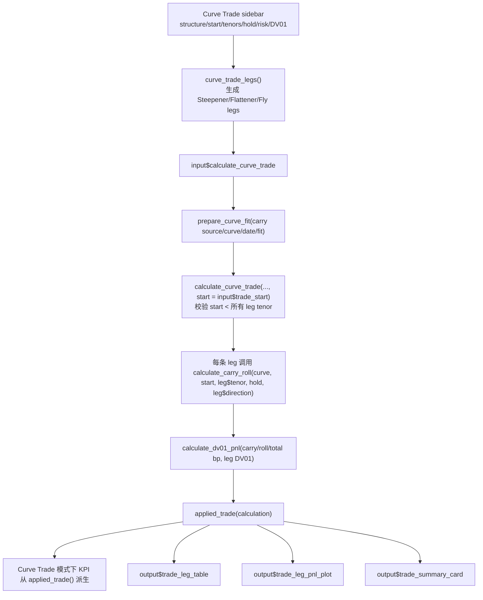

当 workspace 在 Single Trade 时，右下 Curve Trade 区域保留灰色 `NA` 占位，避免用户误读旧 curve trade 结果。切到 Curve Trade 并成功点击计算后，前四个 KPI 改为显示 portfolio carry/roll/total/P&L。

## 12. Diagnostics：跟随 applied_curve()

### 用户操作

```text
先在 Curve Explorer 点击 Apply Curve
再进入 Diagnostics tab
```

### 运行路线

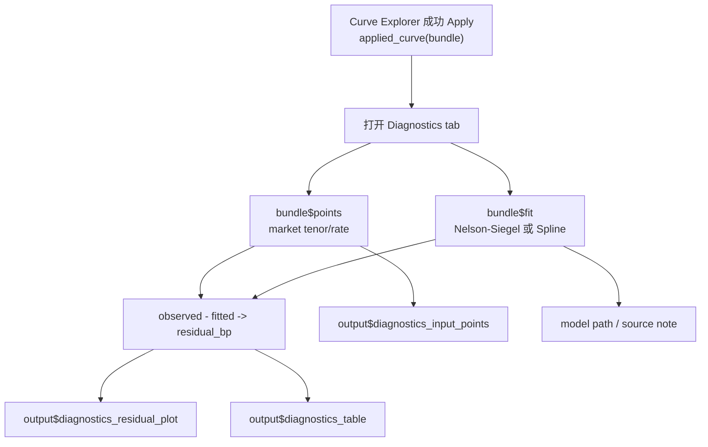

Diagnostics 不自己生成新的 curve result。它是“最近一次成功 applied curve 的检查台”，所以能和 Curve Explorer 保持一致。

## 13. Plotly 和 resize 路线

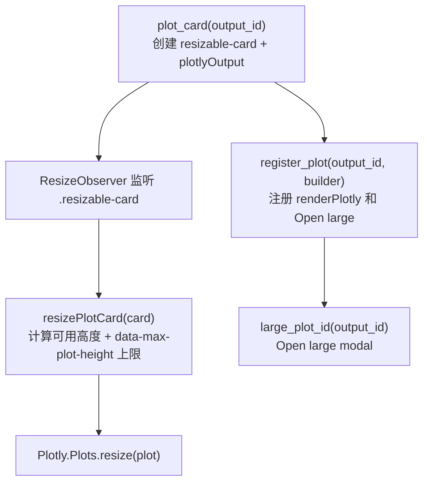

所有 plot 卡片都能手动拖拽调整大小。Carry heatmap、Curve Trade 和 History table 等区域额外设置 `max-height`，防止重复计算后撑开页面。

## 14. 数字和颜色格式

| 语义 | 格式规则 | 例子 | 典型位置 |
|---|---|---|---|
| 利率百分比 | 两位小数 + `%` | `4.25%` | zero rate、forward、fitted rate |
| bp | 一位小数 + `bp` | `-1.5 bp` | carry、roll、change、residual |
| P&L | 四舍五入到个位 | `-14,978` | KPI、summary、legs table |
| 正负变化 | 正值绿色/青色，负值红色 | `+12.0` / `-6.4` | KPI、DT 表格、summary |
| tenor | 使用 `tenor_label()` | `2Y`、`10Y` | curve trade legs、axis、tables |

DT 表格通常先构造 display data frame，再用 HTML span/class 给 direction 和 signed value 着色；需要紧凑显示时关闭 search、paging、sort、scrollX。

## 15. 测试路线

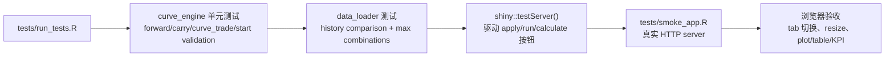

常用命令：

```powershell
& "C:\Program Files\R\R-4.5.2\bin\Rscript.exe" "C:\Users\PC\Desktop\R_git\YieldCurve_Shiny\tests\run_tests.R"
```

HTTP smoke：

```powershell
& "C:\Program Files\R\R-4.5.2\bin\Rscript.exe" "C:\Users\PC\Desktop\R_git\YieldCurve_Shiny\tests\smoke_app.R" 7411
```

## 16. 开发时最容易踩的点

- 不要把 sidebar input 直接当最终结果显示；页面应该显示对应的 `applied_*()`。
- 新增按钮计算时，失败要保留旧结果，只更新 status 为 error。
- 新增 Plotly 卡片时，用 `plot_card()` + `register_plot()`，这样 Open large 和 resize 才一起工作。
- 新增 table 时，先决定 raw numeric data 和 display data frame 的边界，避免排序/格式/颜色互相干扰。
- 历史 proxy 和 zero snapshot 口径不同，文案必须明确，不要写成 live Bloomberg。
- 修改全局 CSS 前先看 Carry、History、Diagnostics 这些高密度 tab，避免一个全局规则把布局撑开或压扁。
